# Evidencia de Desarrollo (capturas)

Esta página reúne las **capturas reales** recopiladas por el propio equipo de desarrollo de Techmovil durante la construcción del sistema (repositorio `Backend-AstramacoIII` / `frontend-astramaco-iii`). No son capturas generadas por el equipo auditor: son la evidencia técnica que el equipo auditor revisó para sustentar los [Papeles de Trabajo](papeles-trabajo.md) y el [Registro de Evidencias](registro-evidencias.md) de esta fase.

Todas las imágenes fuente completas (incluyendo las que no se muestran en línea aquí) quedan disponibles en `docs/assets/img/` dentro de este repositorio, organizadas por carpeta:
`config-herramientas/` (CI/CD backend, 35 capturas) · `config-herramientas-front/` (CI/CD frontend, 8) · `sonarqube-cobertura/` (3) · `sonar-analysis/` (2) · `pruebas-seguridad/` (21) · `manual-usuario/` (11) · `e2e-manual/` (11).

## Estructura del desarrollo {: #estructura-del-desarrollo }

Árbol de directorios del backend, tal como lo documentó el propio equipo en "Pruebas Unitarias" (arquitectura en capas: Controller, Service, Repository, DTO, Model — código de producción separado de las pruebas siguiendo la estructura estándar de Maven):

```
src
├── main/java/com/example/backendastramaco/
│   ├── BackendAstramacoApplication.java
│   ├── config/DataInitializer.java
│   ├── controller/            (Auth, Carga, DocumentoPersonal, Pedido, Transportista, Usuario)
│   ├── dto/                   (Request/Response DTOs por entidad)
│   ├── exception/GlobalExceptionHandler.java
│   ├── model/                 (Carga, DocumentoPersonal, Pedido, Transportista, Usuario)
│   │   ├── audit/             (Auditoria* por entidad + BaseEntity)
│   │   └── enums/              (EstadoPedido, EstadoTransportista, Rol, TipoDocumento, TipoMaterial, TipoTransporte)
│   ├── repository/            (repos JPA + repos audit/)
│   ├── security/
│   │   ├── config/             (CorsConfig, SecurityConfig)
│   │   ├── dto/                 (AuthRequest, AuthResponse)
│   │   ├── jwt/                 (JwtFilter, JwtUtil)
│   │   ├── service/CustomUserDetailsService.java
│   │   └── swagger/OpenApiConfig.java
│   └── service/                (Carga, DocumentoPersonal, Pedido, Transportista, Usuario, audit/)
├── main/resources/             (application.yml, static/, templates/)
└── test/java/.../backendastramaco/  (*UnitTest.java por servicio + controlador + seguridad)
```

Captura real del árbol de directorios del **frontend** (Angular, VS Code):

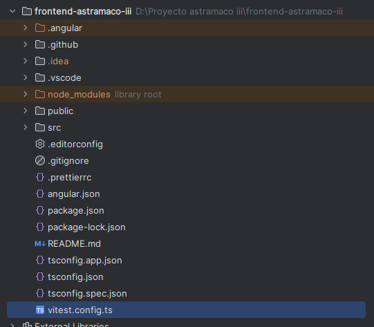

## CI/CD — Backend (GitHub Actions) {: #cicd-backend-github-actions }

El equipo backend documentó paso a paso la puesta en marcha de GitHub Actions (`backend-ci.yml` / `backend-integration.yml`), separando pruebas unitarias e integración, y la generación de reportes SonarQube/CNES. Dos capturas representativas:

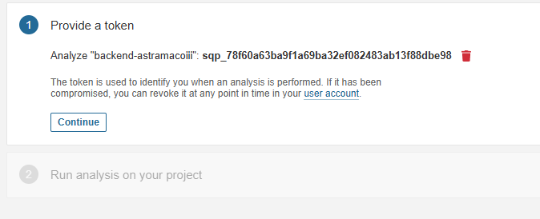
*Alta del token de análisis en SonarQube para `backend-astramacoiii`.*

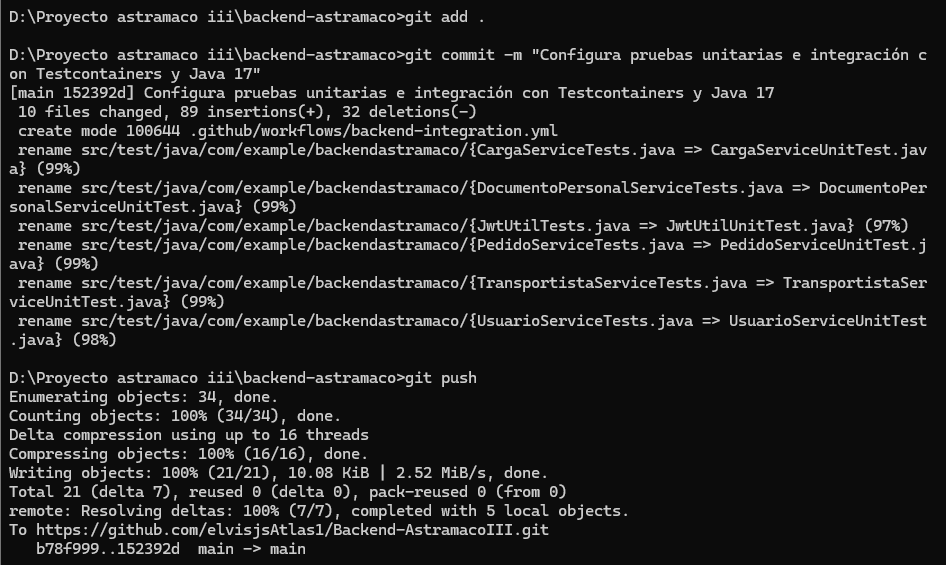
*`git push` tras estandarizar el naming de las pruebas a `*UnitTest` (Testcontainers + Java 17).*

## CI/CD — Frontend (GitHub Actions) {: #cicd-frontend-github-actions }

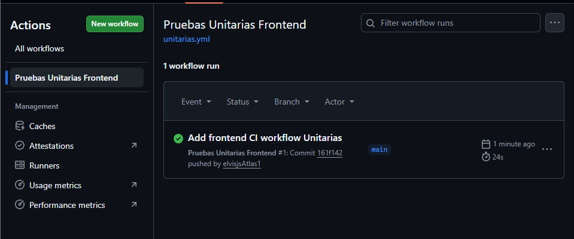
*Workflow `unitarias.yml` del frontend Angular, corrida exitosa (24s) en la rama `main`.*

## SonarQube y cobertura de código {: #sonarqube-y-cobertura-de-codigo }

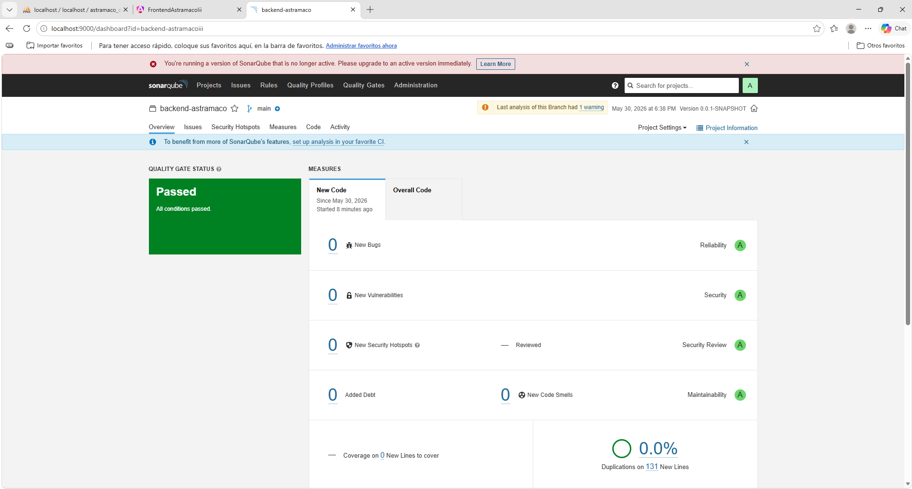
*SonarQube local (`backend-astramaco`, rama `main`): Quality Gate **Passed**, 0 bugs, 0 vulnerabilidades, 43 unit tests, calificación A en confiabilidad/seguridad/mantenibilidad.*

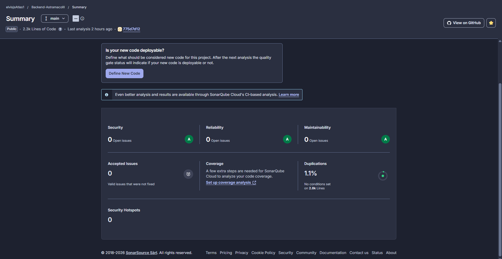
*Resumen del proyecto en SonarCloud (`Backend-AstramacoIII`): 2.3k líneas de código, 0 issues abiertos, 1.1% de duplicación.*

Reporte CNES generado a partir del análisis SonarQube (issues por severidad/tipo, evolución de deuda técnica):

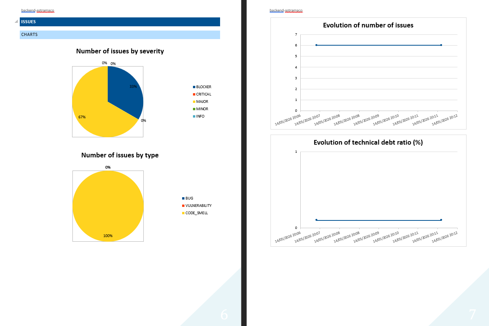

## Pruebas de seguridad {: #pruebas-de-seguridad }

Batería de pruebas documentada en 7 fases: **(1)** descubrimiento con Nmap, **(2)** revisión de la API REST (Swagger `/swagger-ui/index.html`), **(3)** SQL Injection, **(4)** validación de entradas / XSS, **(5)** fuerza bruta sobre `/api/auth/login`, **(6)** cabeceras HTTP, **(7)** OWASP ZAP baseline scan.

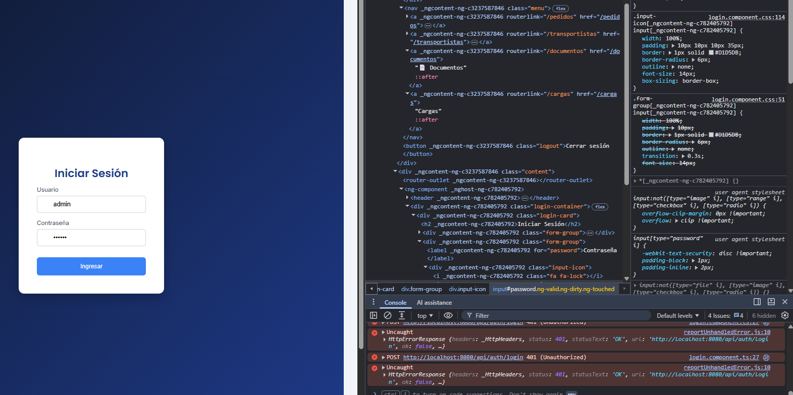
*Prueba de fuerza bruta / validación de credenciales sobre `/api/auth/login`: el backend responde consistentemente `401 Unauthorized`. Hallazgo: falta un mecanismo de *Rate Limiting*.*

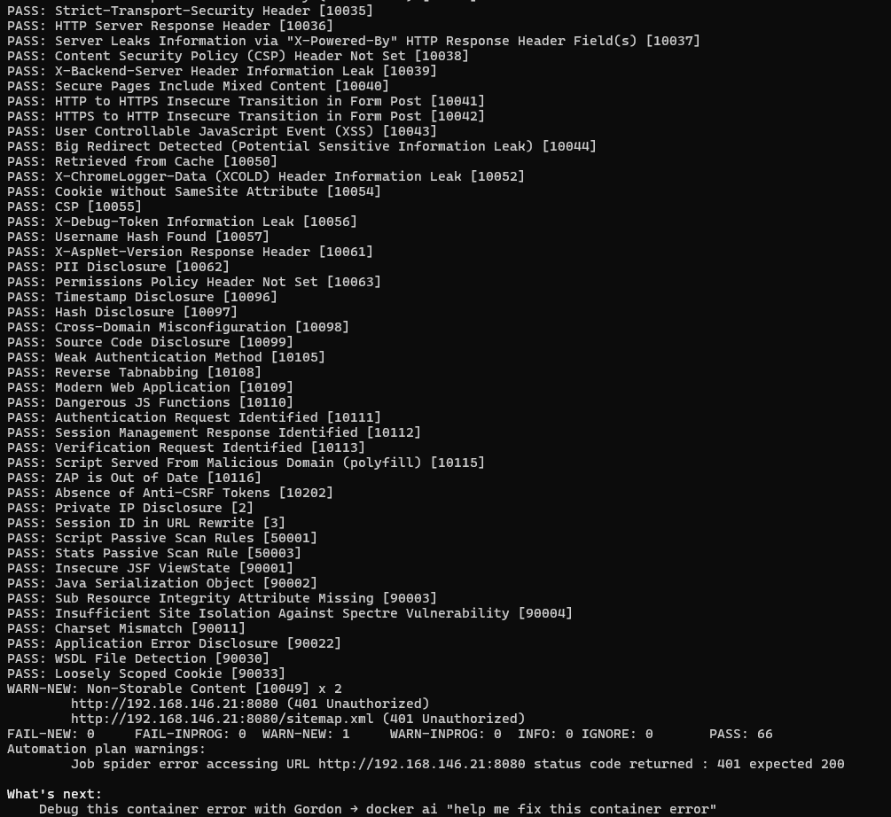
*Salida de `zap-baseline.py` contra el backend: 66 controles **PASS**, 0 **FAIL**, 1 advertencia (contenido no almacenable). Cabeceras `X-Frame-Options: DENY` y `X-Content-Type-Options: nosniff` confirmadas.*

## Swagger / OpenAPI

El backend expone documentación Swagger en `http://localhost:8080/swagger-ui/index.html` (paquete `security/swagger/OpenApiConfig.java`, confirmado también como objetivo de la Fase 2 de pruebas de seguridad, ver arriba).

!!! warning "Sin captura dedicada de Swagger UI"
    Entre los documentos entregados no se incluyó una captura de pantalla específica de la interfaz Swagger UI (solo se referencia su URL como endpoint auditado). Si el equipo cuenta con una, debe añadirse a `docs/assets/img/config-herramientas/` y enlazarse aquí.

## Manual de usuario / pantallas del sistema

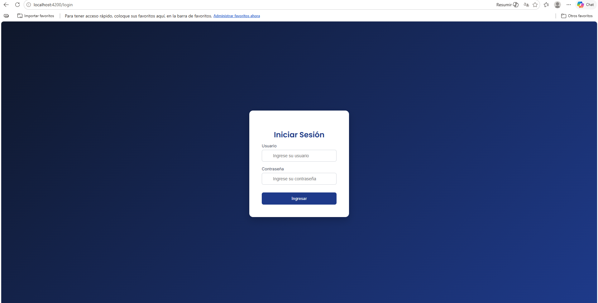
*Pantalla "Iniciar Sesión" del frontend Techmovil (Angular, `localhost:4200`) documentada en el Manual de Usuario.*

## Pruebas E2E manuales

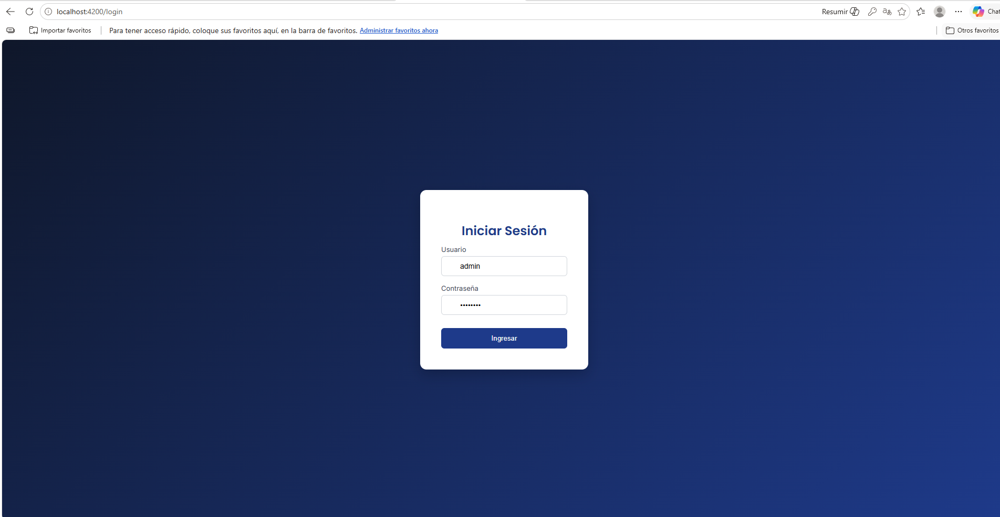
*Mismo flujo de login usado como caso base en el informe de Pruebas de Sistema End-to-End (manuales).*

## Pruebas unitarias — hallazgo {: #pruebas-unitarias-hallazgo }

!!! danger "No hay capturas de evidencia para pruebas unitarias"
    El documento **"Pruebas Unitarias"** entregado por el equipo de desarrollo describe correctamente la ficha técnica, el repositorio y el árbol de directorios (reproducido arriba), pero **no incluye una sola captura de pantalla** de una ejecución de pruebas, un reporte de cobertura por clase o una salida de consola — solo trae la carátula institucional. Lo mismo ocurre con el documento "Pruebas Integrales".

    Esto es consistente con — y confirma de forma independiente — el hallazgo propio de la auditoría: **PT-005 "Cumple Parcialmente"** en los [Papeles de Trabajo](papeles-trabajo.md) y la **no conformidad menor** del [Informe Final](../fase3/informe-final.md) ("limitada documentación de pruebas unitarias automatizadas"). La evidencia indirecta de que las pruebas sí se ejecutan existe (ver la corrida de GitHub Actions y el conteo de "43 Unit Tests" en el dashboard de SonarQube más arriba), pero el entregable formal de pruebas unitarias carece de evidencia visual propia.

    **Recomendación:** adjuntar al documento "Pruebas Unitarias" al menos: (1) una captura de la ejecución `mvnw test` en consola, (2) el reporte JaCoCo de cobertura por clase, y (3) el resumen de resultados de GitHub Actions para el job de pruebas unitarias.
