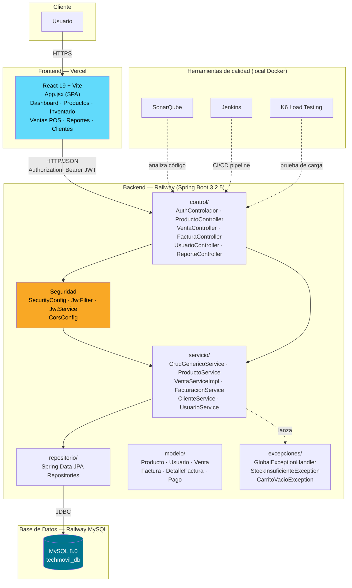
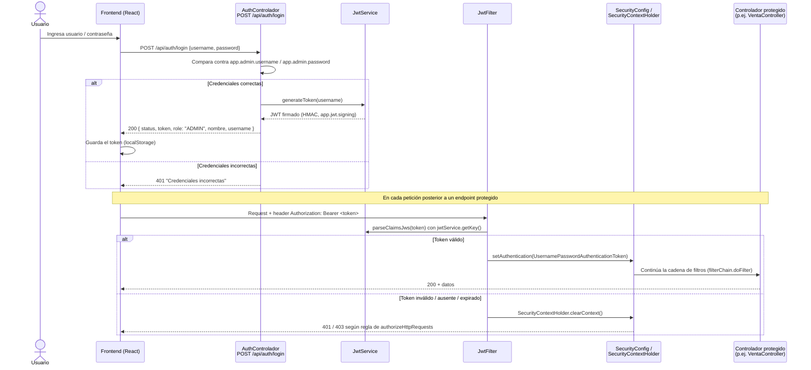
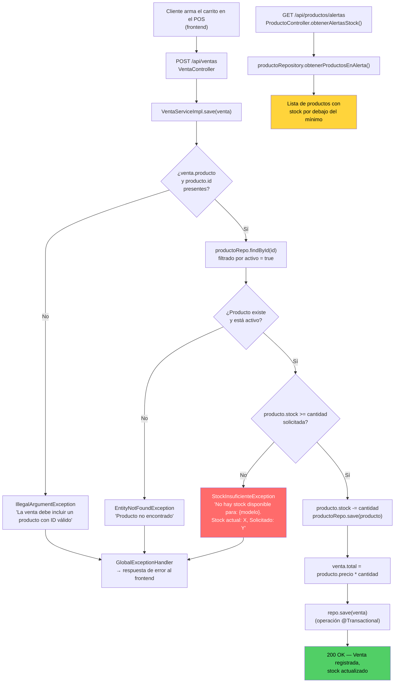

# Diagramas de Arquitectura

Estos diagramas se generaron a partir del **código fuente real** del repositorio (`FINTECHMOVIL/backend` y `FINTECHMOVIL/frontend`), no son ilustrativos ni genéricos. Sustituyen el hueco señalado en la [Fase 2 — Evidencia de Desarrollo](../fase2/evidencia-desarrollo.md#estructura-del-desarrollo) y en el [Registro de Evidencias](../fase2/registro-evidencias.md) (EV-010 a EV-012), donde se referenciaban diagramas C4/UML que no se habían incluido como imagen.

## 1. Diagrama general de arquitectura (C4 — Contenedores)

**Notas de la arquitectura real:**

- El frontend es una **SPA de un solo archivo grande** (`App.jsx`, ~1400 líneas + ~4900 líneas de CSS embebido), sin router de terceros — el "ruteo" es manejo de estado de React.
- `SecurityConfig` deshabilita CSRF intencionalmente (API REST *stateless* consumida por SPA, autenticación por `Authorization: Bearer <JWT>`, no por cookies de sesión) — comentario textual en el propio código: *"CSRF deshabilitado intencionalmente: API REST stateless consumida por SPA React."*
- Varios endpoints de lectura (`GET /api/**`) y de escritura de `clientes`/`productos` están marcados `permitAll()` deliberadamente, para permitir demo/fallback a datos mock del frontend cuando el backend no está disponible.
- SonarQube, Jenkins y K6 corren localmente vía Docker Compose (`FINTECHMOVIL/backend/docker-compose.yml`), no forman parte del entorno de producción (Railway/Vercel).

## 2. Flujo de autenticación (JWT)

**Notas del flujo real:**

- `/api/auth/**` y la documentación Swagger (`/swagger-ui/**`, `/v3/api-docs/**`) están siempre públicas (`permitAll()`).
- El usuario administrador es único y se valida contra propiedades de configuración (`app.admin.username` / `app.admin.password`, por defecto `admin` / `admin123`), **no** contra una tabla de usuarios con múltiples cuentas para el login inicial.
- `JwtFilter` extiende `OncePerRequestFilter` y se registra antes de `UsernamePasswordAuthenticationFilter` (`addFilterBefore`).
- Si el JWT es inválido, el filtro limpia el contexto de seguridad pero **no interrumpe la cadena** — la petición sigue y es la regla de `authorizeHttpRequests` (`anyRequest().authenticated()` para lo no listado como público) la que finalmente devuelve 401/403.

## 3. Flujo de inventario (venta y control de stock)

**Notas del flujo real:**

- Toda la operación de venta corre dentro de una única transacción (`@Transactional` en `VentaServiceImpl.save`): si falla el guardado de la venta, el descuento de stock también se revierte.
- El control de stock insuficiente es **a nivel de aplicación** (comparación `producto.getStock() < cantidad`), no una restricción de base de datos.
- El catálogo (`ProductoController`) expone CRUD completo (`GET`, `POST`, `PUT`, `DELETE /api/productos`) más un endpoint dedicado `/api/productos/alertas` para productos con stock bajo, usado por el Dashboard del frontend para las alertas visuales.
- El `DELETE` de producto es un borrado **lógico** (marca `activo = false`), no elimina el registro físico — por eso `VentaServiceImpl` filtra explícitamente `p.getActivo()`.

---

*Diagramas construidos a partir de: `AuthControlador.java`, `JwtFilter.java`, `JwtService.java`, `SecurityConfig.java`, `ProductoController.java`, `VentaServiceImpl.java` — commit vigente de la rama en el momento de escribir esta página. Si el código cambia, estos diagramas deben regenerarse.*
