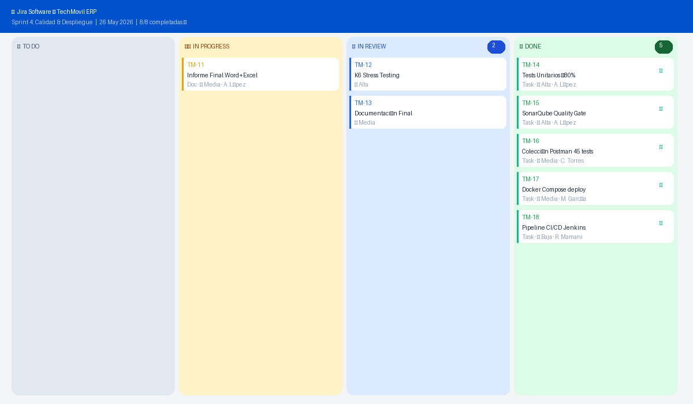

# Gestión de Proyecto (Jira)

*Gestión del Proyecto — Jira Software. Proyecto: TechMovil ERP. Metodología: Scrum. Herramienta: Jira Software (Atlassian). URL del proyecto: `https://techmovil.atlassian.net` — Clave: TM. Junio 2026.*

## 1. Tablero Scrum — Sprint 4

*Figura 1: Tablero Jira Sprint 4 — Estado final con 8 de 8 tareas DONE.*

## 2. Backlog completo — historias de usuario

| ID | Epic | Historia de Usuario | Tipo | Prioridad | Sprint | Estado |
|---|---|---|---|---|---|---|
| TM-01 | Seguridad | Como usuario quiero iniciar sesión con JWT para acceder de forma segura | Story | 🔴 Alta | Sprint 1 | ✅ DONE |
| TM-02 | Seguridad | Como nuevo usuario quiero registrarme con email y contraseña segura | Story | 🔴 Alta | Sprint 1 | ✅ DONE |
| TM-03 | Seguridad | Como sistema quiero roles ADMIN/CLIENTE para controlar el acceso | Story | 🔴 Alta | Sprint 1 | ✅ DONE |
| TM-04 | Productos | Como admin quiero hacer CRUD de productos para gestionar el catálogo | Story | 🔴 Alta | Sprint 1 | ✅ DONE |
| TM-05 | Productos | Como usuario quiero buscar y filtrar productos para encontrarlos rápido | Story | 🟡 Media | Sprint 1 | ✅ DONE |
| TM-06 | Inventario | Como admin quiero controlar el stock para evitar quiebre de inventario | Story | 🔴 Alta | Sprint 2 | ✅ DONE |
| TM-07 | Inventario | Como admin quiero registrar entradas y salidas para un historial claro | Story | 🔴 Alta | Sprint 2 | ✅ DONE |
| TM-08 | Inventario | Como sistema quiero alertas automáticas de stock bajo | Story | 🟡 Media | Sprint 2 | ✅ DONE |
| TM-09 | Ventas | Como vendedor quiero un POS para registrar ventas con carrito | Story | 🔴 Alta | Sprint 2 | ✅ DONE |
| TM-10 | Ventas | Como sistema quiero calcular IGV 18% automáticamente en cada venta | Story | 🔴 Alta | Sprint 2 | ✅ DONE |
| TM-11 | Frontend | Como admin quiero ver el dashboard con KPIs, gráficos y alertas | Story | 🔴 Alta | Sprint 3 | ✅ DONE |
| TM-12 | Frontend | Como admin quiero ver reportes visuales con gráficos de ventas | Story | 🟡 Media | Sprint 3 | ✅ DONE |
| TM-13 | Frontend | Como admin quiero gestionar clientes con CRUD completo | Story | 🟡 Media | Sprint 3 | ✅ DONE |
| TM-14 | Calidad | Como equipo queremos tests unitarios con ≥80% de cobertura | Task | 🔴 Alta | Sprint 4 | ✅ DONE |
| TM-15 | Calidad | Como equipo queremos SonarQube Quality Gate nivel A | Task | 🔴 Alta | Sprint 4 | ✅ DONE |
| TM-16 | Calidad | Como equipo queremos colección Postman con 45 assertions | Task | 🟡 Media | Sprint 4 | ✅ DONE |
| TM-17 | Deploy | Como equipo queremos Docker Compose para despliegue completo | Task | 🟡 Media | Sprint 4 | ✅ DONE |
| TM-18 | Deploy | Como equipo queremos pipeline CI/CD Jenkins automatizado | Task | 🟢 Baja | Sprint 4 | ✅ DONE |

## 3. Planificación de sprints

| Sprint | Objetivo Principal | Inicio | Fin | Ítems | Vel. |
|---|---|---|---|---|---|
| Sprint 1 | Backend: Autenticación JWT + CRUD Productos + Seguridad | 01/04/2026 | 14/04/2026 | 5 / 5 | 40 |
| Sprint 2 | Backend: Inventario + Ventas POS + Facturación IGV | 15/04/2026 | 28/04/2026 | 5 / 5 | 45 |
| Sprint 3 | Frontend: Dashboard + POS + Reportes + Clientes | 29/04/2026 | 12/05/2026 | 3 / 3 | 38 |
| Sprint 4 | Calidad: Tests, SonarQube, Postman, Docker, CI/CD | 13/05/2026 | 26/05/2026 | 5 / 5 | 42 |
| **TOTALES** | 18 historias de usuario — 100% completadas | — | 26/05/2026 (8 semanas) | 18/18 | 165 |

## 4. Métricas de velocidad

- Velocidad promedio: **41.25 puntos / sprint**.
- Bugs encontrados: **4** (todos resueltos en el mismo sprint — 0 deuda técnica).
- Cobertura final: **83.7%** (umbral: 80% — superado en 3.7 puntos porcentuales).
- Tiempo total del proyecto: **8 semanas** (2 meses).

## 5. Definición de Listo (DoD)

- ✅ Código implementado y funcionando en entorno local.
- ✅ Tests unitarios escritos (cobertura ≥80% en el módulo).
- ✅ Code review completado por el equipo.
- ✅ SonarQube: 0 issues críticos — Quality Gate aprobado.
- ✅ Pruebas de integración Postman: endpoints verificados.
- ✅ Documentación actualizada (Swagger + Word).
- ✅ Merge exitoso a rama main en GitHub.
- ✅ Demo al Product Owner aprobada.
