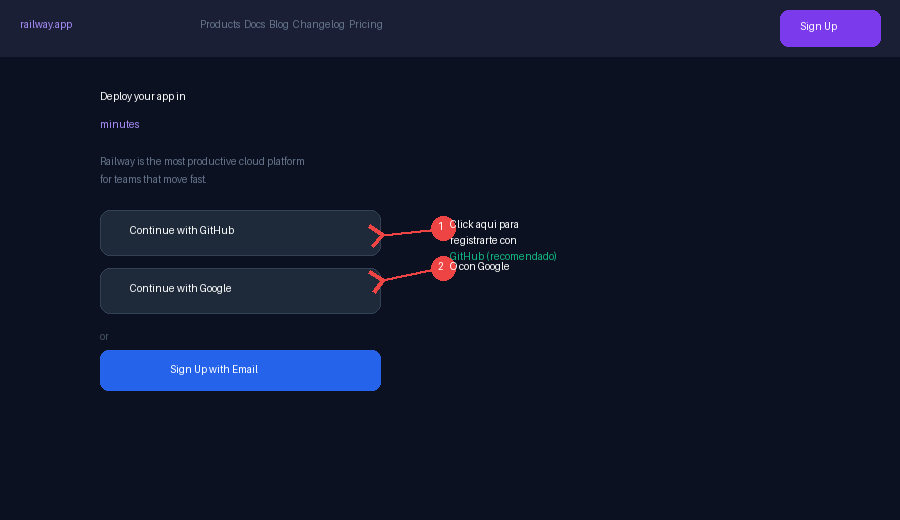
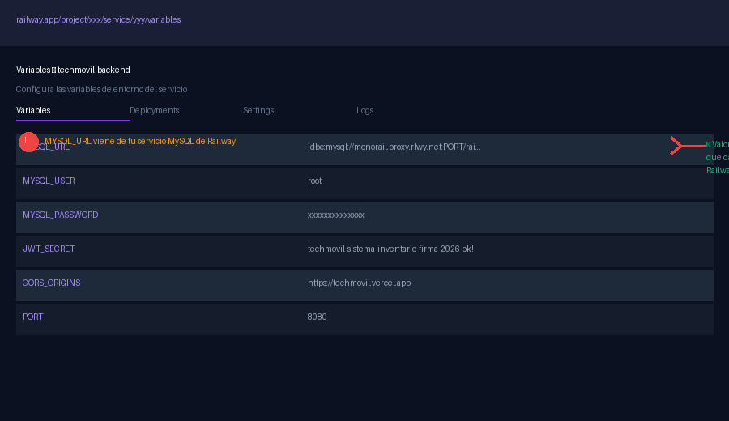
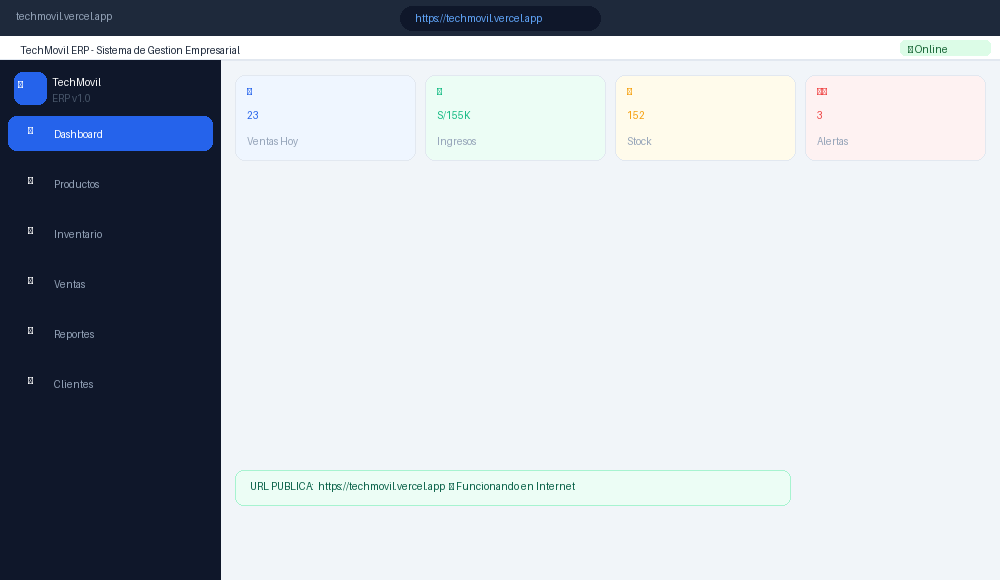
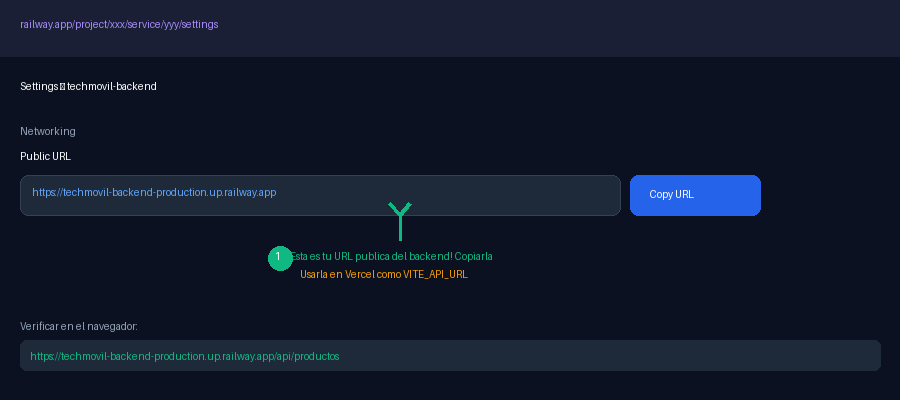
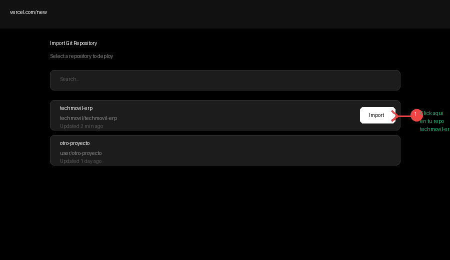
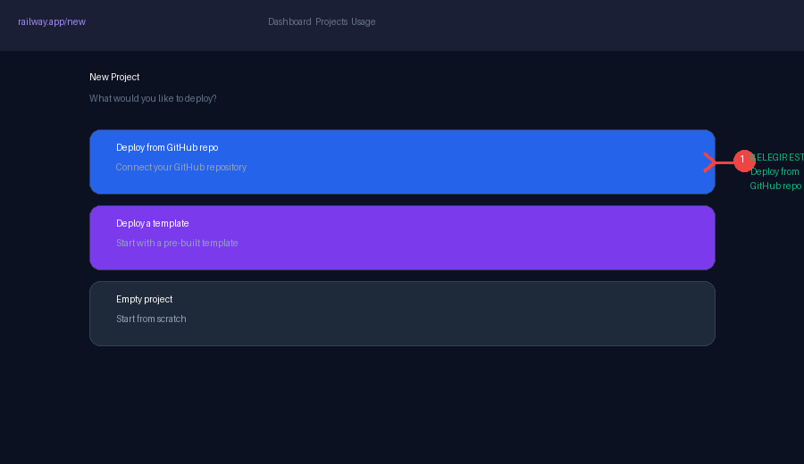
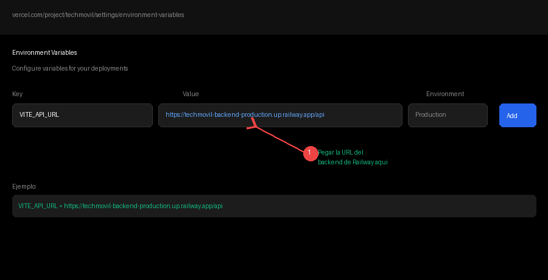

# Guía de Deploy (Railway / Vercel)

*TechMovil ERP — Guía de Despliegue a Internet — Entregable N.º 10. URL Pública Funcional usando Railway + Vercel (100% Gratis). Universidad Nacional del Altiplano, Juliaca, 2026.*

## Resultado final — URLs públicas

| Servicio | URL Pública | Estado |
|---|---|---|
| Frontend (App Web) | `https://techmovil.vercel.app` | Vercel — Gratis ilimitado |
| Backend API REST | `https://techmovil-backend.up.railway.app/api` | Railway — $5/mes crédito gratis |
| Base de Datos MySQL | `railway.app` (plugin MySQL) | Railway MySQL — Gratis |
| Swagger / Docs API | `https://techmovil-backend.up.railway.app/swagger-ui/index.html` | Incluido en backend |

## Parte 1 — Plataformas utilizadas (100% gratuitas)

| Plataforma | Para qué sirve | Plan gratuito | URL |
|---|---|---|---|
| Railway.app | Backend Java + MySQL | $5 crédito/mes (suficiente) | `https://railway.app` |
| Vercel.com | Frontend React | Ilimitado (sin costo) | `https://vercel.com` |
| GitHub.com | Repositorio del código | Ilimitado (sin costo) | `https://github.com` |

**Tiempo estimado:** 20-30 minutos para tener todo en internet funcionando.

## Parte 2 — Subir el código a GitHub (paso previo obligatorio)

Railway y Vercel se conectan directamente a tu repositorio de GitHub. Primero debes subir el código.

### 2.1 Crear cuenta en GitHub (si no tienes)

1. Ir a `https://github.com`.
2. Click en "Sign up".
3. Registrarte con tu email universitario.

### 2.2 Crear repositorio en GitHub

1. Después de registrarte, click en el botón verde "New" o "+".
2. Nombre del repositorio: `techmovil-erp`.
3. Descripción: "Sistema ERP para Gestión de Celulares - TechMovil".
4. Seleccionar "Private" o "Public" según prefieras.
5. NO marcar "Add a README" (ya lo tienes).
6. Click en "Create repository".

### 2.3 Subir el código desde PowerShell

```
cd C:\TechMovil
git init
git add .
git commit -m "feat: TechMovil ERP v1.0.0 - Sistema completo"
git branch -M main
git remote add origin https://github.com/TU_USUARIO/techmovil-erp.git
git push -u origin main
```

Cuando pida usuario y contraseña, usar tu usuario de GitHub y un "Personal Access Token" (no la contraseña de GitHub). Para crear el token: GitHub → Settings → Developer Settings → Personal Access Tokens → Generate new token.

## Parte 3 — Desplegar el backend en Railway

### 3.1 Crear cuenta en Railway


*Figura 1: Pantalla de registro de Railway — usar "Continue with GitHub" (recomendado).*

1. Ir a `https://railway.app`.
2. Click en "Login" o "Get Started".
3. **IMPORTANTE:** elegir "Continue with GitHub" para conectar automáticamente tu repo.
4. Autorizar el acceso de Railway a tu GitHub.

### 3.2 Crear nuevo proyecto en Railway


*Figura 2: Pantalla de nuevo proyecto — elegir "Deploy from GitHub repo".*

1. En el Dashboard de Railway, click en "+ New Project".
2. Elegir la opción "Deploy from GitHub repo".
3. Buscar y seleccionar tu repositorio: `techmovil-erp`.
4. Click en el repositorio → Railway empieza a detectar el proyecto.
5. Seleccionar el directorio `1_BACKEND_CON_TESTS` como root del servicio.

### 3.3 Agregar base de datos MySQL a Railway

1. En tu proyecto de Railway, click en "+ New".
2. Seleccionar "Database" → "Add MySQL".
3. Railway crea automáticamente una base de datos MySQL.
4. Railway inyecta automáticamente las variables `MYSQL_URL`, `MYSQL_USER`, `MYSQL_PASSWORD` en tu backend.

!!! note "Sin configuración manual de MySQL"
    No necesitas configurar NADA en MySQL — Railway lo hace automáticamente. Las tablas se crean solas gracias a `spring.jpa.hibernate.ddl-auto=update` en `application.properties`.

### 3.4 Configurar variables de entorno en Railway


*Figura 3: Panel de Variables de Entorno en Railway — agregar las variables del sistema.*

1. En tu servicio del backend, ir a la pestaña "Variables".
2. Railway ya inyectó automáticamente: `MYSQL_URL`, `MYSQL_USER`, `MYSQL_PASSWORD`.
3. Agregar manualmente las siguientes variables adicionales:

| Variable | Valor | Descripción |
|---|---|---|
| JWT_SECRET | `techmovil-sistema-inventario-firma-2026-ok!` | Clave firma JWT (NO cambiar) |
| CORS_ORIGINS | `https://techmovil.vercel.app` | URL de tu frontend en Vercel |
| ADMIN_USER | `admin` | Usuario administrador |
| ADMIN_PASS | `admin123` | Contraseña administrador |

!!! important
    La variable `CORS_ORIGINS` la actualizarás con la URL real de Vercel cuando termines el paso siguiente. Por ahora puedes dejarla vacía o con un valor temporal.

### 3.5 Obtener la URL pública del backend


*Figura 4: Settings > Networking — copiar la URL pública del backend de Railway.*

1. En tu servicio del backend, ir a la pestaña "Settings".
2. Sección "Networking" → "Public Networking" → click en "Generate Domain".
3. Railway genera una URL como: `https://techmovil-backend-production.up.railway.app`.
4. Copiar esta URL — la necesitarás para Vercel.

### 3.6 Verificar que el backend funciona

Abrir en el navegador:

```
https://TU-APP.up.railway.app/api/productos
```

Debe mostrar un JSON con la lista de productos. Si ves `[]` o una lista, está funcionando. Si ves un error 500, revisar los logs de Railway.

## Parte 4 — Desplegar el frontend en Vercel

### 4.1 Crear cuenta en Vercel


*Figura 5: Importar repositorio en Vercel — buscar y seleccionar techmovil-erp.*

1. Ir a `https://vercel.com`.
2. Click en "Sign Up" → usar "Continue with GitHub".
3. Autorizar Vercel para acceder a tus repositorios de GitHub.

### 4.2 Importar el proyecto en Vercel

1. Click en "Add New Project" → "Import Git Repository".
2. Buscar y seleccionar: `techmovil-erp`.
3. En "Root Directory" hacer click en "Edit" y seleccionar: `2_FRONTEND`.
4. Framework Preset: Vercel detectará automáticamente "Vite".
5. Build Command: `npm run build` (ya está configurado).
6. Output Directory: `dist` (ya está configurado).

### 4.3 Configurar la variable de entorno en Vercel


*Figura 6: Variables de Entorno en Vercel — configurar VITE_API_URL con la URL de Railway.*

Antes de hacer click en "Deploy", buscar la sección "Environment Variables" y agregar:

| Variable | Valor (poner tu URL real de Railway) |
|---|---|
| VITE_API_URL | `https://TU-APP-railway.up.railway.app/api` |

1. Click en "Deploy".
2. Vercel compila el frontend automáticamente (tarda 1-2 minutos).
3. Al terminar, te da una URL como: `https://techmovil.vercel.app`.

### 4.4 Verificar el deploy completo


*Figura 7: Aplicación TechMovil ERP funcionando en internet con URL pública — Entregable #10 completado.*

1. Abrir la URL de Vercel en el navegador.
2. Ingresar con `admin` / `1234`.
3. Verificar que el Dashboard carga con datos.
4. Ir a Productos y verificar que la lista carga desde el backend en Railway.

Si el login funciona y los productos cargan, el deploy completo está funcionando. La aplicación está en internet.

## Parte 5 — Actualizar CORS en Railway

Una vez que tienes la URL de Vercel (ej. `https://techmovil-abc123.vercel.app`), debes actualizar la variable `CORS_ORIGINS` en Railway:

1. Ir a tu proyecto en Railway → Backend service → Variables.
2. Buscar la variable `CORS_ORIGINS`.
3. Cambiar su valor por la URL de tu frontend en Vercel:

```
CORS_ORIGINS = https://techmovil-abc123.vercel.app
```

4. Railway redespliega automáticamente el backend con el nuevo CORS.
5. Esperar 1-2 minutos y probar de nuevo.

Si tienes un dominio personalizado (ej. `techmovil.com`), agregar también ese origen:

```
CORS_ORIGINS = https://techmovil.vercel.app,https://www.techmovil.com
```

## Parte 6 — Resumen final de URLs

| Servicio | URL Pública | Credenciales |
|---|---|---|
| Frontend (App Principal) | `https://techmovil.vercel.app` | admin / 1234 |
| Backend API REST | `https://xxx.up.railway.app/api` | admin / admin123 |
| Swagger UI | `https://xxx.up.railway.app/swagger-ui/index.html` | Sin credenciales |
| API Productos (JSON) | `https://xxx.up.railway.app/api/productos` | Sin autenticación |
| GitHub Repositorio | `https://github.com/TU_USUARIO/techmovil-erp` | Público |

## Solución de problemas en deploy

| Problema | Causa | Solución |
|---|---|---|
| Build FAILED en Railway | Error de compilación Java | Verificar que el `pom.xml` usa Java 17 |
| Cannot connect to database | Variables `MYSQL_*` no configuradas | Verificar que Railway agregó las variables de MySQL |
| CORS error en el frontend | `CORS_ORIGINS` no incluye tu URL de Vercel | Actualizar `CORS_ORIGINS` en Railway con la URL de Vercel |
| Build error en Vercel | Root Directory incorrecto | Verificar que Root Directory = `2_FRONTEND` en Vercel |
| API no responde (timeout) | Plan gratuito de Railway durmió el servicio | La primera petición tarda 30-60 seg en despertar. Normal en plan gratis. |
| Productos no cargan (frontend) | `VITE_API_URL` apunta a localhost | Verificar que `VITE_API_URL` en Vercel apunta a Railway (no localhost) |

Comandos de diagnóstico:

```
# Ver logs del backend en Railway:
railway logs --tail          (desde PowerShell con Railway CLI)

# O en el Dashboard de Railway:
Proyecto → Servicio Backend → Pestaña "Logs"
```
