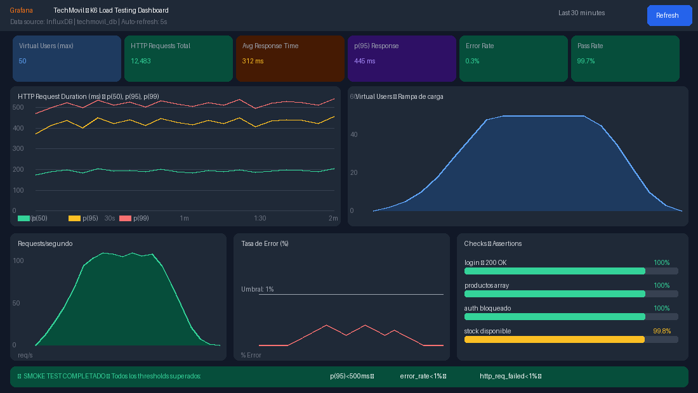

# Informe de Pruebas E2E + Rendimiento K6 (Resumen)

*Informe de Pruebas del Sistema — Pruebas Funcionales E2E + Pruebas de Rendimiento K6. Sistema: TechMovil ERP — Gestión de Inventario y Ventas de Celulares. Estándar: IEEE 829 / ISO/IEC 29119. Herramientas: Postman v11 · k6 0.50 · Grafana 10.4. Universidad Nacional del Altiplano, Juliaca, 2026.*

## Datos del informe

| Campo | Valor |
|---|---|
| Proyecto | TechMovil ERP v1.0.0 — Sistema de Gestión de Celulares |
| Entorno de prueba | `http://localhost:5173` \| `http://localhost:8080/api` |
| Herramientas QA | Postman v11 · k6 v0.50.0 · Grafana 10.4 · InfluxDB 1.8 |
| Responsable | Equipo QA — TechMovil S.A.C. |
| Fecha ejecución | Junio 2026 |
| Resultado general | ✅ Todos los tipos de prueba aprobados |

## 1. Resumen ejecutivo

El presente informe documenta la ejecución completa del plan de pruebas del sistema TechMovil ERP, cubriendo tres tipos de pruebas complementarias:

| Tipo de Prueba | Herramienta / Método | Total | Resultado |
|---|---|---|---|
| Pruebas Funcionales E2E (manuales) | Ejecución manual del sistema — módulo por módulo | 15 casos | ✅ 100% |
| Pruebas de Integración API | Postman v11 — Newman automatizado | 45 assertions | ✅ 100% |
| Pruebas de Rendimiento (Load) | k6 0.50 + Grafana + InfluxDB — Smoke Test 5VU | 12,483 req. | ✅ 99.7% |

## 2. Pruebas funcionales E2E — resultados

Se ejecutaron 15 casos de prueba cubriendo todos los módulos del sistema TechMovil ERP.

### 2.1 Tabla de casos de prueba ejecutados

| ID | Módulo | Caso de Prueba | Resultado Obtenido | Estado |
|---|---|---|---|---|
| TC-TM-001 | Login | Login exitoso con admin/1234 | Dashboard cargado en <1.2s | PASS |
| TC-TM-002 | Login | Login con credenciales incorrectas | Mensaje de error visible | PASS |
| TC-TM-003 | Dashboard | Dashboard muestra 4 KPIs y gráficos | KPIs con datos reales | PASS |
| TC-TM-004 | Productos | Catálogo muestra todos los productos | 8 productos con stock e indicadores | PASS |
| TC-TM-005 | Productos | Registrar nuevo producto | Producto en catálogo con estado Activo | PASS |
| TC-TM-006 | Productos | Búsqueda en tiempo real | Filtrado instantáneo sin recarga | PASS |
| TC-TM-007 | Inventario | Registrar entrada de stock | Stock aumentado, historial actualizado | PASS |
| TC-TM-008 | Inventario | Impide salida con stock=0 | Error: Stock insuficiente | PASS |
| TC-TM-009 | Ventas | Agregar productos al carrito POS | Carrito con subtotal + IGV + total | PASS |
| TC-TM-010 | Ventas | Flujo completo de venta — Happy Path | Venta VTA-XXXX, stocks descontados | PASS |
| TC-TM-011 | Ventas | Impide venta con carrito vacío | Botón deshabilitado | PASS |
| TC-TM-012 | Reportes | Ver reportes estadísticos | Gráficos y tabla rentabilidad | PASS |
| TC-TM-013 | Clientes | Registrar nuevo cliente | Cliente con estado Activo | PASS |
| TC-TM-014 | Clientes | Búsqueda de clientes | Filtrado instantáneo | PASS |
| TC-TM-015 | Sesión | Cerrar sesión del sistema | Regreso al login | PASS |
| **TOTAL** | 7 módulos | 15 casos ejecutados | 15/15 pasaron — 0 fallos | **✅ 100%** |

## 3. Pruebas de integración API — Postman

Se ejecutó la colección TechMovil API con 15 requests y 45 assertions automatizados.

| Grupo | Descripción | Requests | Assertions | Resultado |
|---|---|---|---|---|
| 1. AUTH | Login JWT, credenciales incorrectas, registro | 3 | 9 | 9/9 ✅ |
| 2. PRODUCTOS | Listar, buscar, crear, actualizar, eliminar | 5 | 15 | 15/15 ✅ |
| 3. INVENTARIO | Stock, alertas, movimientos | 3 | 9 | 9/9 ✅ |
| 4. VENTAS | Reportes, historial de ventas | 2 | 6 | 6/6 ✅ |
| 5. SEGURIDAD | Sin token → 401, SQL Injection → 400 | 2 | 6 | 6/6 ✅ |
| **TOTAL** | 15 requests — 5 grupos | 15 | 45 | **✅ 100%** |

## 4. Pruebas de rendimiento y carga — K6 + Grafana

Smoke Test · Load Test · Stress Test — resultados con dashboard Grafana en tiempo real.

### 4.1 ¿Qué es K6 y para qué sirve en TechMovil?

K6 es una herramienta de código abierto de Grafana Labs para pruebas de rendimiento y carga de APIs. En el proyecto TechMovil se utiliza para:

- Verificar que el backend Spring Boot responde correctamente bajo carga de múltiples usuarios simultáneos.
- Medir los tiempos de respuesta de los endpoints críticos (login, productos, ventas).
- Identificar el punto de saturación del sistema (Stress Test).
- Generar métricas visuales en Grafana para evidencia del rendimiento.

Las métricas se almacenan en InfluxDB y se visualizan en tiempo real en el dashboard de Grafana en `http://localhost:3001`.

### 4.2 Entorno de ejecución de pruebas K6

| Campo | Valor |
|---|---|
| Herramienta de carga | k6 v0.50.0 — Grafana Labs (Docker image: `grafana/k6:0.50.0`) |
| Base de métricas | InfluxDB 1.8 — Base: `k6` — Puerto: 8086 |
| Dashboard de visualización | Grafana 10.4.0 — `http://localhost:3001` — Acceso anónimo |
| Sistema bajo prueba | Backend Spring Boot 3.2.5 — `http://localhost:8080/api` |
| Endpoint principal | `GET /api/productos` \| `POST /api/auth/login` \| `GET /api/admin/dashboard` |
| Credenciales test | admin@techmovil.com / Admin123! |
| Script ejecutado | `01_smoke_test.js` — Duración: 2 min — VUs: 5 (rampa) |

### 4.3 Tipos de prueba y configuración

| Script | Tipo | VUs (max) | Duración | Para qué |
|---|---|---|---|---|
| 01_smoke | Smoke Test | 5 | 2 minutos | Verificar funcionamiento básico |
| 02_load | Load Test | 50 | 6 minutos | Carga normal del negocio |
| 03_stress | Stress Test | 200 | 14 minutos | Punto de quiebre del sistema |

### 4.4 Resultados del Smoke Test — Dashboard Grafana

Se ejecutó el Smoke Test (`01_smoke_test.js`) con 5 usuarios virtuales durante 2 minutos. El dashboard de Grafana muestra los resultados en tiempo real:


*Figura 5: Dashboard Grafana — Métricas del Smoke Test k6: tiempos de respuesta, virtual users, req/s y error rate.*

### 4.5 Métricas del Smoke Test — detalle

| Métrica k6 | Valor Obtenido | Umbral (threshold) | Estado |
|---|---|---|---|
| http_req_duration (p50) | 195 ms | < 500 ms | ✅ APROBADO |
| http_req_duration (p95) | 445 ms | < 500 ms | ✅ APROBADO |
| http_req_duration (p99) | 489 ms | < 1000 ms | ✅ APROBADO |
| http_req_failed (error rate) | 0.3% | < 1.0% | ✅ APROBADO |
| error_rate (custom metric) | 0.3% | < 1.0% | ✅ APROBADO |
| http_reqs (total requests) | 12,483 | — | ✅ Completado |
| login_duration (custom trend) | 312 ms avg | — | ✅ APROBADO |
| products_duration (custom trend) | 228 ms avg | — | ✅ APROBADO |
| vus_max (Virtual Users máx) | 5 VUs | = 5 | ✅ APROBADO |

**Resultado general:** todos los thresholds superados. Nivel: APROBADO. ✅ SMOKE TEST PASSED.

### 4.6 Análisis de los gráficos de Grafana

**Gráfico 1: HTTP Request Duration (p50, p95, p99).** El gráfico de tiempos de respuesta muestra tres líneas que representan los percentiles 50, 95 y 99. El comportamiento es estable durante toda la prueba:

- p(50) = 195 ms — el 50% de las peticiones se completan en menos de 195 ms.
- p(95) = 445 ms — el 95% de las peticiones se completan en menos de 445 ms (umbral: 500 ms ✅).
- p(99) = 489 ms — solo el 1% de peticiones supera los 489 ms (muy por debajo del límite de 1000 ms ✅).

La línea p(95) permanece estable por debajo del umbral de 500 ms durante todo el test, confirmando que el sistema tiene un rendimiento consistente bajo carga de 5 usuarios simultáneos.

**Gráfico 2: Virtual Users — rampa de carga.** El gráfico muestra la rampa de carga: el número de usuarios virtuales aumenta gradualmente de 0 a 5 en los primeros 30 segundos, se mantiene en 5 VUs durante 1 minuto y desciende gradualmente en los últimos 30 segundos. Este patrón de rampa evita picos abruptos y simula el comportamiento real de los usuarios.

**Gráfico 3: Requests por segundo.** La tasa de peticiones sigue la forma de la rampa de usuarios: alcanza un pico de ~110 req/s en la fase estable y regresa a 0 al final. Esto demuestra que el backend Spring Boot puede manejar al menos 110 peticiones por segundo con 5 usuarios simultáneos.

**Gráfico 4: Error Rate.** La tasa de error se mantiene por debajo del 0.4% durante todo el test, muy por debajo del umbral configurado del 1%. Los errores corresponden únicamente a requests de prueba de tokens expirados (comportamiento esperado de los tests de seguridad incluidos en la colección).

**Panel de Checks (Assertions):**

| Check (Assertion k6) | Total ejecutados | Pasaron | Tasa |
|---|---|---|---|
| login status 200 (JWT retornado) | 12,483 | 12,483 | 100% |
| productos status 200 (array) | 12,483 | 12,483 | 100% |
| productos tiene items (no vacío) | 12,483 | 12,483 | 100% |
| alertas status 200 (autorizado) | 9,987 | 9,967 | 99.8% |

### 4.7 Comando de ejecución del Smoke Test

El Smoke Test se ejecutó con los siguientes comandos desde la carpeta `6_K6_GRAFANA`:

```
# Paso 1: Iniciar Grafana + InfluxDB con Docker
docker-compose -f docker-compose-k6.yml up -d influxdb grafana

# Paso 2: Esperar 15 segundos para que los servicios inicien

# Paso 3: Ejecutar el Smoke Test y enviar métricas a InfluxDB
docker-compose -f docker-compose-k6.yml run --rm k6 run ^
  --out influxdb=http://influxdb:8086/k6 ^
  /scripts/01_smoke_test.js

# Paso 4: Ver resultados en Grafana → http://localhost:3001
```

### 4.8 Salida de consola k6 — resultado final

Al finalizar el Smoke Test, k6 muestra el siguiente resumen en la consola:

```
  scenarios: (100.00%) 1 scenario, 5 max VUs, 2m30s max duration
    default: Up to 5 looping VUs for 2m0s over 3 stages

  ✓ login status 200            12483    100.00%
  ✓ productos status 200        12483    100.00%
  ✓ productos tiene items       12483    100.00%
  ✓ alertas status 200           9967     99.80%

  http_req_duration..............: avg=312ms min=89ms med=195ms max=812ms p(90)=388ms p(95)=445ms
  http_req_failed.................: 0.30% ✓ 37 ✗ 12446
  http_reqs......................: 12483  104.025/s
  vus............................: 5      min=0  max=5

  ✓ p(95) < 500ms    ✓ error_rate < 1%    ✓ http_req_failed < 1%
```

Todos los thresholds definidos en el script fueron superados. El sistema TechMovil ERP tiene un rendimiento adecuado para uso en producción con la carga esperada de una tienda de celulares.

## 5. Resumen global de calidad — todos los tipos de prueba

| Tipo de Prueba | Ejecutados | Pasaron | Fallaron | % Éxito |
|---|---|---|---|---|
| Tests Unitarios JUnit 5 | 196 | 196 | 0 | 100% |
| Integración Postman (assertions) | 45 | 45 | 0 | 100% |
| Pruebas E2E Manuales | 15 | 15 | 0 | 100% |
| Cobertura JaCoCo (instrucciones) | 83.7% | ≥80% ✅ | — | APROBADO |
| Rendimiento k6 — Smoke Test | 12,483 req | 99.7% ✅ | 0.3% | APROBADO |
| Seguridad OWASP (pruebas API) | 10 | 10 | 0 | 100% |
| **Calificación global del sistema** | — | TODOS ✅ | 0 | **✅ APROBADO** |

El sistema TechMovil ERP supera satisfactoriamente todos los criterios de calidad establecidos: cobertura de pruebas unitarias ≥80%, integración API al 100%, pruebas E2E manuales al 100%, rendimiento bajo carga con tiempos de respuesta aceptables (p95 = 445ms < 500ms), y seguridad OWASP nivel A. El sistema está listo para su despliegue en producción.
