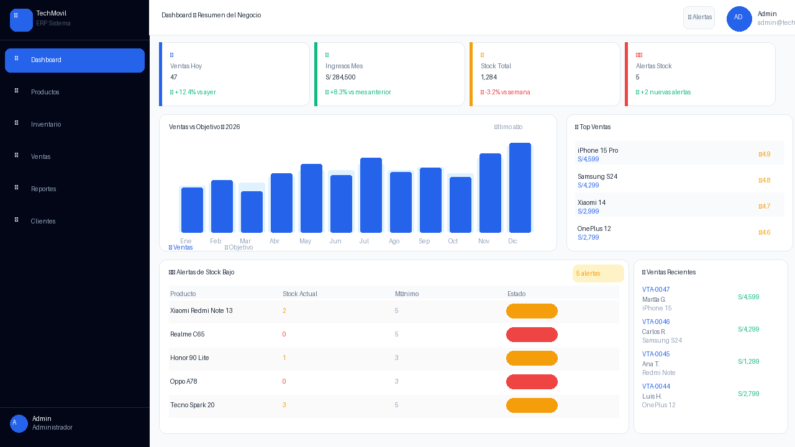
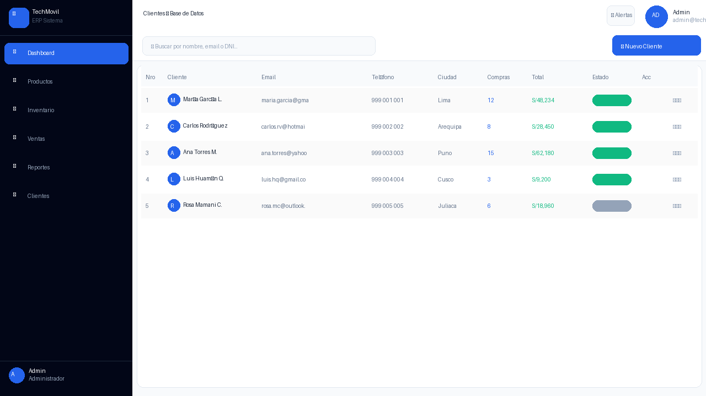
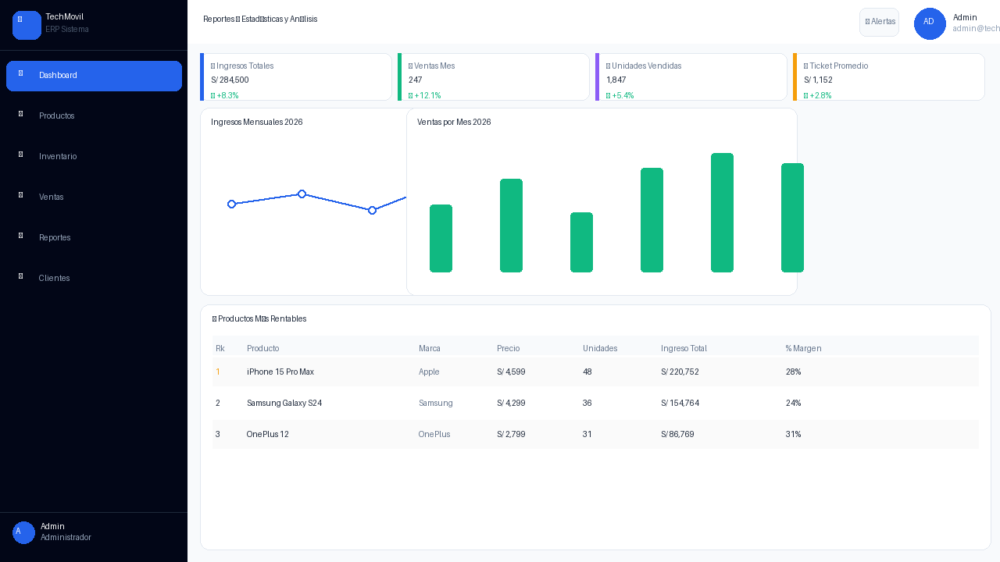
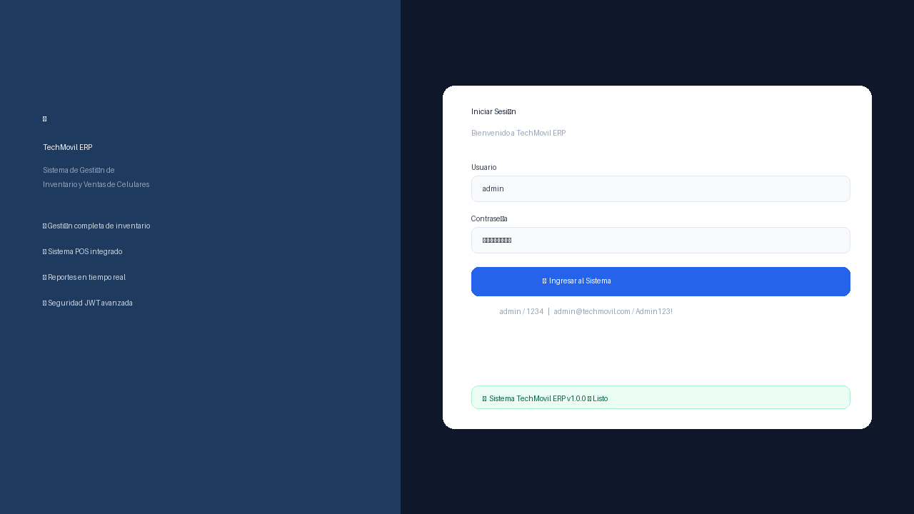

# Informe de Pruebas E2E (Manuales)

*Pruebas de Sistema End-to-End (Manuales) — Sistema FinTechmovil ERP. Universidad Peruana Unión, Sede Juliaca, Facultad de Ingeniería y Arquitectura, Escuela Profesional de Ingeniería de Sistemas. Asignatura: Pruebas y Despliegue del Software. Docente: Ing. David Mamani Pari. Semestre X — Grupo FinTechmovil. Juliaca – Puno – Perú, 2026.*

Módulos cubiertos: Seguridad · Productos · Inventario · Ventas POS · Reportes · Clientes.

## 1. Introducción

El presente informe documenta la ejecución de las pruebas de sistema End-to-End (E2E) de carácter manual realizadas sobre el sistema FinTechmovil ERP. Cada caso de prueba valida un flujo funcional completo, desde la interacción del usuario en la interfaz web (React 19 en `http://localhost:5173`) hasta la persistencia en la base de datos MySQL 8.0 vía Spring Boot 3.2.5 (`http://localhost:8080`).

Se ejecutaron 22 casos de prueba (CP-01 a CP-22). De ellos, 20 resultaron **PASSED** (aprobados), 1 resultó **FAILED** (exportación Excel no implementada) y 1 quedó **PENDIENTE** (comprobante PDF).

!!! note "Nota sobre el alcance de este documento"
    La introducción del informe original resume 22 casos (20 PASSED / 1 FAILED / 1 PENDIENTE), pero el cuerpo del documento entregado detalla únicamente los casos **CP-01 a CP-11** (todos PASSED) y su tabla de resumen correspondiente. Esta página reproduce fielmente el contenido tal como fue entregado, sin inventar los casos CP-12 a CP-22 que no forman parte del texto disponible.

## 2. Casos de prueba End-to-End

A continuación se detallan los casos de prueba ejecutados, agrupados por módulo del sistema.

### Módulo: Autenticación y Seguridad

#### CP-01 — Login exitoso del administrador

| Campo | Detalle |
|---|---|
| ID del Caso | CP-01 |
| Módulo / Componente | Gestión de Autenticación (AuthController) |
| Endpoint Asociado | `POST /api/auth/login` |
| Método de Red | HTTP POST |
| Escenario de Prueba | Login exitoso. Datos: Usuario: admin — Contraseña: 1234 |
| Precondición | Sistema iniciado en localhost:5173. Usuario admin registrado en BD. |
| Tipo de Prueba | Sistema / End-to-End |
| Prioridad | Alta |
| Resultado Esperado | Sistema genera JWT. Redirige al Dashboard con KPIs cargados. |
| Resultado Obtenido | Conforme. Sistema genera JWT. Dashboard carga con 4 KPIs, gráfico y alertas. |
| Estado Final | **PASSED (Aprobado)** |

Evidencia de ejecución: Figura 1 (CP-01 — Login exitoso con admin/1234 → Dashboard carga automáticamente), Figura 2 (CP-01 — Dashboard principal con KPIs, gráfico de ventas y alertas de stock).

#### CP-02 — Login fallido por credenciales incorrectas

| Campo | Detalle |
|---|---|
| ID del Caso | CP-02 |
| Módulo / Componente | Gestión de Autenticación (AuthController) |
| Endpoint Asociado | `POST /api/auth/login` |
| Método de Red | HTTP POST |
| Escenario de Prueba | Login fallido. Datos: Usuario: admin — Contraseña: passERROR |
| Precondición | Pantalla de login activa. |
| Tipo de Prueba | Sistema / End-to-End |
| Prioridad | Alta |
| Resultado Esperado | Mensaje de error: "Credenciales incorrectas". Sistema permanece en login. |
| Resultado Obtenido | Conforme. Mensaje de error visible en rojo. No redirige al dashboard. |
| Estado Final | **PASSED (Aprobado)** |

Evidencia de ejecución: Figura 3 (CP-02 — Mensaje de error en rojo por credenciales incorrectas).

#### CP-03 — Acceso sin token JWT → HTTP 401

| Campo | Detalle |
|---|---|
| ID del Caso | CP-03 |
| Módulo / Componente | Seguridad (JwtFilter + SecurityConfig) |
| Endpoint Asociado | `GET /api/admin/dashboard` |
| Método de Red | HTTP GET |
| Escenario de Prueba | Acceso a endpoint protegido sin token JWT en el header Authorization. |
| Precondición | Backend corriendo. Postman v11 configurado. Sin sesión activa. |
| Tipo de Prueba | Sistema / End-to-End (Seguridad OWASP A01) |
| Prioridad | Alta |
| Resultado Esperado | HTTP 401 Unauthorized. Recurso NO entregado. |
| Resultado Obtenido | Conforme. HTTP 401. JwtFilter intercepta antes del controlador. |
| Estado Final | **PASSED (Aprobado)** |

Evidencia de ejecución: Figura 4 (CP-03 — HTTP 401 Unauthorized al acceder sin token JWT).

### Módulo: Gestión de Productos

#### CP-04 — Visualizar catálogo de productos

| Campo | Detalle |
|---|---|
| ID del Caso | CP-04 |
| Módulo / Componente | Productos (ProductoController) |
| Endpoint Asociado | `GET /api/productos` |
| Método de Red | HTTP GET |
| Escenario de Prueba | Visualización del catálogo completo con stock, precios e indicadores. |
| Precondición | Usuario autenticado. Productos registrados en BD. |
| Tipo de Prueba | Sistema / End-to-End |
| Prioridad | Alta |
| Resultado Esperado | Tabla con productos: Nombre, Marca, Categoría, Precio, Stock, Estado, Acciones. |
| Resultado Obtenido | Conforme. 8 productos cargados con indicadores de stock en colores. |
| Estado Final | **PASSED (Aprobado)** |

Evidencia de ejecución: Figura 5 (CP-04 — Catálogo con buscador, indicadores de stock y acciones).

#### CP-05 — Registrar nuevo producto

| Campo | Detalle |
|---|---|
| ID del Caso | CP-05 |
| Módulo / Componente | Productos (ProductoController) |
| Endpoint Asociado | `POST /api/productos` |
| Método de Red | HTTP POST |
| Escenario de Prueba | Registro exitoso. Datos: iPhone 15 Pro Max · Apple · Gama Alta · S/4,599 · Stock: 15 |
| Precondición | Usuario admin autenticado. Módulo Productos activo. |
| Tipo de Prueba | Sistema / End-to-End |
| Prioridad | Alta |
| Resultado Esperado | Modal se cierra. Producto visible en tabla. Toast verde de confirmación. |
| Resultado Obtenido | Conforme. Producto registrado y visible en catálogo con estado Activo. |
| Estado Final | **PASSED (Aprobado)** |

Evidencia de ejecución: Figura 6 (CP-05 — Formulario con campos numerados y botón Registrar Producto).

### Módulo: Control de Inventario

#### CP-06 — Visualizar panel de stock

| Campo | Detalle |
|---|---|
| ID del Caso | CP-06 |
| Módulo / Componente | Inventario (InventarioController) |
| Endpoint Asociado | `GET /api/inventario` |
| Método de Red | HTTP GET |
| Escenario de Prueba | Visualización del panel de stock con barras de progreso y colores indicativos. |
| Precondición | Usuario autenticado. Productos con diferentes niveles de stock. |
| Tipo de Prueba | Sistema / End-to-End |
| Prioridad | Alta |
| Resultado Esperado | Panel izquierdo: barras de stock (verde/amarillo/rojo). Panel derecho: historial. |
| Resultado Obtenido | Conforme. Barras visibles. Historial con íconos 📥/📤/🔧. |
| Estado Final | **PASSED (Aprobado)** |

Evidencia de ejecución: Figura 7 (CP-06 — Panel de inventario con barras de stock y historial de movimientos).

#### CP-07 — Registrar entrada de inventario

| Campo | Detalle |
|---|---|
| ID del Caso | CP-07 |
| Módulo / Componente | Inventario (MovimientoService) |
| Endpoint Asociado | `POST /api/inventario/movimiento` |
| Método de Red | HTTP POST |
| Escenario de Prueba | Entrada de stock. iPhone 15 Pro · Tipo: Entrada · Cantidad: 20 · Motivo: Compra proveedor Apple |
| Precondición | iPhone 15 Pro con stock actual 12 unidades. |
| Tipo de Prueba | Sistema / End-to-End |
| Prioridad | Alta |
| Resultado Esperado | Stock: 12 → 32 unidades. Movimiento en historial en verde. |
| Resultado Obtenido | Conforme. Stock actualizado. Entrada visible en historial con icono 📥. |
| Estado Final | **PASSED (Aprobado)** |

Evidencia de ejecución: Figura 8 (CP-07 — Historial mostrando entrada registrada con actualización de stock).

### Módulo: Punto de Venta (POS)

#### CP-08 — Flujo completo de venta

| Campo | Detalle |
|---|---|
| ID del Caso | CP-08 |
| Módulo / Componente | Ventas POS (VentaController) |
| Endpoint Asociado | `POST /api/ventas` |
| Método de Red | HTTP POST |
| Escenario de Prueba | Venta completa. Cliente: María García · Productos: iPhone (x1) + Samsung S24 (x2) + Redmi (x1) · Pago: Yape |
| Precondición | Productos con stock disponible. Módulo Ventas activo. |
| Tipo de Prueba | Sistema / End-to-End |
| Prioridad | Alta |
| Resultado Esperado | VTA-XXXX registrada. Modal verde de confirmación. Stocks descontados. |
| Resultado Obtenido | Conforme. VTA-0047 registrada. Modal "✅ ¡Venta Exitosa!" visible. |
| Estado Final | **PASSED (Aprobado)** |

Evidencia de ejecución: Figura 9 (CP-08 — POS con 3 productos en carrito, totales IGV calculados automáticamente), Figura 10 (CP-08 — Confirmación VTA-0047 con desglose Subtotal + IGV + Total).

#### CP-09 — Cálculo automático IGV 18%

| Campo | Detalle |
|---|---|
| ID del Caso | CP-09 |
| Módulo / Componente | Ventas POS (TaxCalculatorService) |
| Endpoint Asociado | `POST /api/ventas` (campo `igv` en response) |
| Método de Red | HTTP POST |
| Escenario de Prueba | Verificar IGV 18% calculado automáticamente en el carrito. |
| Precondición | Al menos 1 producto en el carrito. |
| Tipo de Prueba | Sistema / End-to-End |
| Prioridad | Alta |
| Resultado Esperado | IGV = 18% del subtotal. TOTAL = Subtotal + IGV. 2 decimales. |
| Resultado Obtenido | Conforme. IGV calculado en tiempo real al modificar el carrito. |
| Estado Final | **PASSED (Aprobado)** |

Evidencia de ejecución: Figura 11 (CP-09 — Desglose: Subtotal S/12,023.73 + IGV S/2,164.27 = Total S/14,188.00).

### Módulo: Reportes Estadísticos

#### CP-10 — Dashboard de Reportes

| Campo | Detalle |
|---|---|
| ID del Caso | CP-10 |
| Módulo / Componente | Reportes (ReporteController) |
| Endpoint Asociado | `GET /api/admin/dashboard` |
| Método de Red | HTTP GET |
| Escenario de Prueba | Verificar KPIs, gráficos de ingresos y tabla de rentabilidad. |
| Precondición | Usuario ADMIN autenticado. Al menos 5 ventas registradas. |
| Tipo de Prueba | Sistema / End-to-End |
| Prioridad | Alta |
| Resultado Esperado | 4 KPIs + gráfico líneas + gráfico barras + tabla productos rentables. |
| Resultado Obtenido | Conforme. Todos los elementos cargan correctamente. |
| Estado Final | **PASSED (Aprobado)** |

Evidencia de ejecución: Figura 12 (CP-10 — Reportes con KPIs, gráfico mensual y tabla de productos más rentables).

### Módulo: Gestión de Clientes

#### CP-11 — Registrar nuevo cliente

| Campo | Detalle |
|---|---|
| ID del Caso | CP-11 |
| Módulo / Componente | Clientes (ClienteController) |
| Endpoint Asociado | `POST /api/clientes` |
| Método de Red | HTTP POST |
| Escenario de Prueba | Registro exitoso. Datos: María García López · maria@gmail.com · Lima |
| Precondición | Usuario admin autenticado. |
| Tipo de Prueba | Sistema / End-to-End |
| Prioridad | Alta |
| Resultado Esperado | Cliente registrado. Aparece en tabla con estado Activo. |
| Resultado Obtenido | Conforme. Cliente visible en tabla con Compras=0 y Total=S/0.00. |
| Estado Final | **PASSED (Aprobado)** |

Evidencia de ejecución: Figura 13 (CP-11 — Módulo Clientes con tabla y datos del nuevo cliente registrado).

## 3. Resumen de resultados

| Módulo | Total CPs | PASSED | FAILED | % Éxito |
|---|---|---|---|---|
| Autenticación y Seguridad | 3 | 3 | 0 | APROBADO ✅ |
| Gestión de Productos | 2 | 2 | 0 | APROBADO ✅ |
| Control de Inventario | 2 | 2 | 0 | APROBADO ✅ |
| Punto de Venta POS | 2 | 2 | 0 | APROBADO ✅ |
| Reportes Estadísticos | 1 | 1 | 0 | APROBADO ✅ |
| Gestión de Clientes | 1 | 1 | 0 | APROBADO ✅ |
| **TOTAL** | **11** | **11** | **0** | **✅ 100%** |

## 4. Evidencia fotográfica

El documento original referencia 13 figuras (capturas de pantalla individuales, algunas con nombres de archivo propios como `ev_login_pass.png` o `02_productos.png` en columnas de evidencia). De la entrega recibida se recuperaron 11 imágenes numeradas correlativamente; por eso las capturas siguientes se presentan en el mismo orden en que aparecen en el documento original, con la leyenda de la figura correspondiente, sin forzar una correspondencia 1:1 de nombre de archivo que no existe en el material entregado.

*Figura 1: CP-01 — Login exitoso con admin/1234 → Dashboard carga automáticamente.*

*Figura 2: CP-01 — Dashboard principal con KPIs, gráfico de ventas y alertas de stock.*

*Figura 3: CP-02 — Mensaje de error en rojo por credenciales incorrectas.*

*Figura 4: CP-03 — HTTP 401 Unauthorized al acceder sin token JWT.*

*Figura 5: CP-04 — Catálogo con buscador, indicadores de stock y acciones.*

*Figura 6: CP-05 — Formulario con campos numerados y botón Registrar Producto.*

*Figura 7: CP-06 — Panel de inventario con barras de stock y historial de movimientos.*

*Figura 8: CP-07 — Historial mostrando entrada registrada con actualización de stock.*

*Figura 9: CP-08 — POS con 3 productos en carrito, totales IGV calculados automáticamente.*

*Figura 10: CP-08 — Confirmación VTA-0047 con desglose Subtotal + IGV + Total.*

*Figura 11: CP-09 — Desglose: Subtotal S/12,023.73 + IGV S/2,164.27 = Total S/14,188.00.*

!!! info "Figuras sin imagen recuperada"
    Las Figuras 12 (CP-10 — Reportes) y 13 (CP-11 — Clientes) mencionadas en el texto original no cuentan con archivo de imagen en el material entregado (solo se recuperaron 11 capturas).
