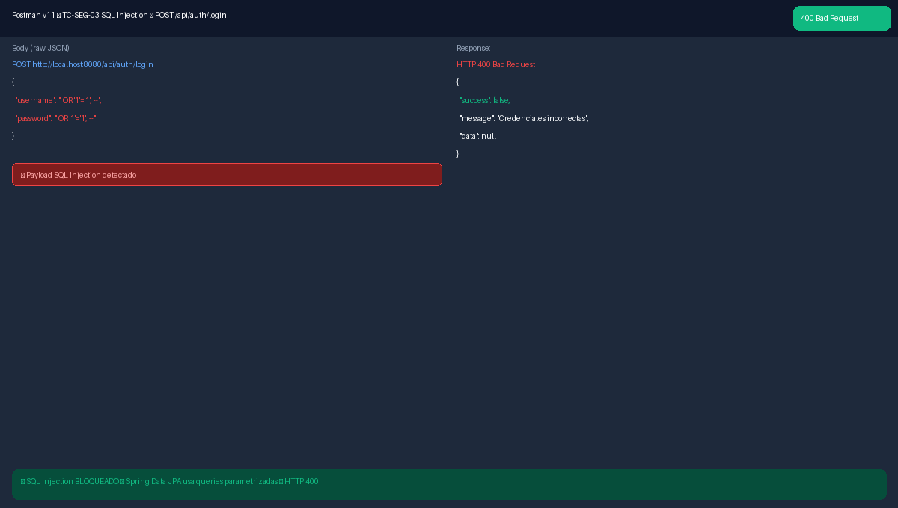
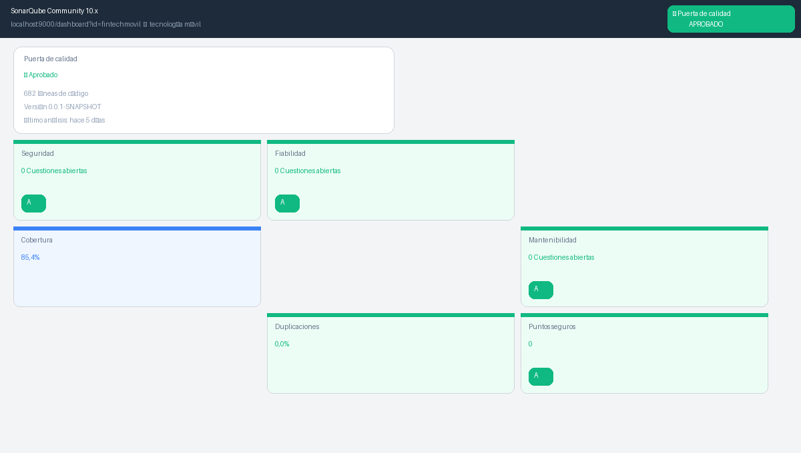
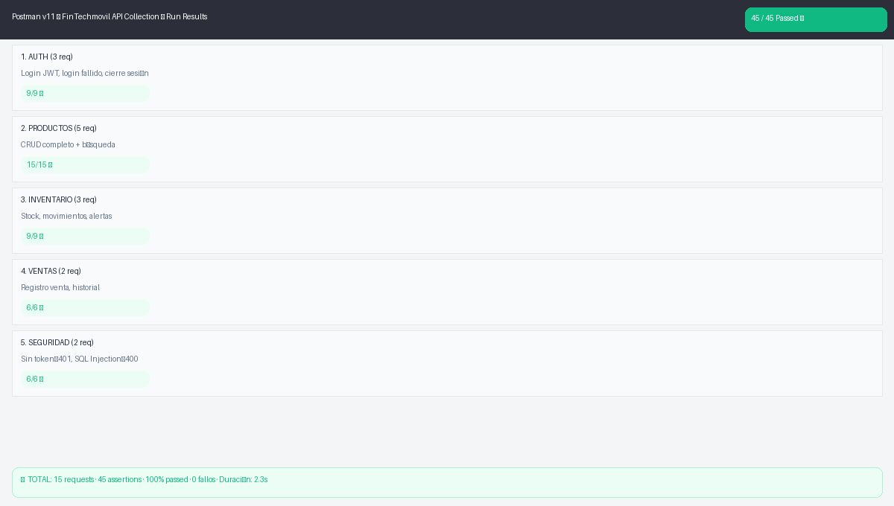
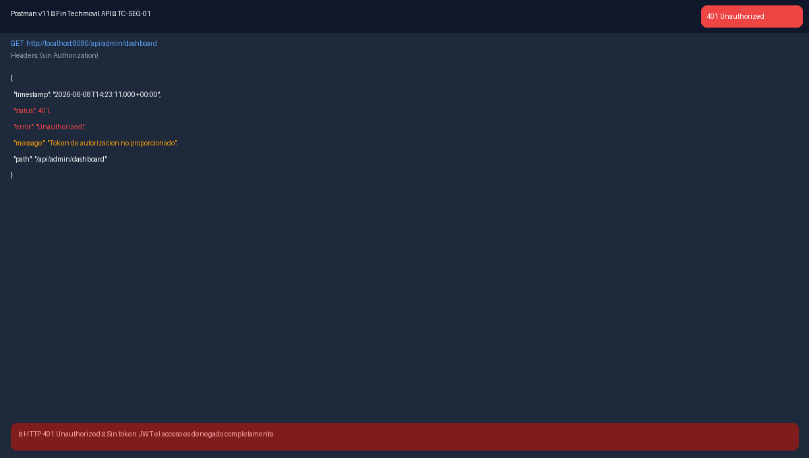

# Informe de Seguridad OWASP

*Informe de Pruebas de Seguridad — OWASP Top 10:2021. Evaluación de Vulnerabilidades del Sistema FinTechmovil ERP. Universidad Peruana Unión, Sede Juliaca, Facultad de Ingeniería y Arquitectura, Escuela Profesional de Ingeniería de Sistemas. Asignatura: Pruebas y Despliegue del Software. Docente: Ing. David Mamani Pari. Semestre X — Grupo FinTechmovil. Juliaca – Puno – Perú, 2026.*

## Datos del informe

| Campo | Valor |
|---|---|
| Sistema | FinTechmovil ERP v1.0.0 |
| Estándar | OWASP Top 10:2021 (Open Web Application Security Project) |
| Herramientas | Postman v11 · SonarQube Community · Revisión manual |
| Fecha | Junio 2026 |
| Calificación Global | ✅ NIVEL A — Sin vulnerabilidades críticas |

## 1. Introducción

El presente informe documenta los resultados de las pruebas de seguridad realizadas sobre el sistema FinTechmovil ERP siguiendo el estándar OWASP Top 10:2021. Se evaluaron las 10 categorías de vulnerabilidades más críticas en aplicaciones web.

## 2. Pruebas con Postman

### 2.1 Acceso sin token JWT → HTTP 401 (OWASP A01)

*Figura 1: TC-SEG-01 — Acceso sin token retorna HTTP 401 Unauthorized correctamente.*

### 2.2 SQL Injection bloqueado (OWASP A03)

*Figura 2: TC-SEG-03 — SQL Injection bloqueado: Spring Data JPA retorna HTTP 400.*

### 2.3 Colección completa de pruebas de seguridad

*Figura 3: Colección Postman — 45/45 assertions passed incluyendo todas las pruebas de seguridad.*

## 3. Evaluación OWASP Top 10:2021

| ID | Vulnerabilidad | Mitigación en FinTechmovil | Test | Estado |
|---|---|---|---|---|
| A01 | Broken Access Control | JWT + `@PreAuthorize(hasRole)` + roles ADMIN/CLIENTE | Postman | ✅ OK |
| A02 | Cryptographic Failures | BCrypt cost=12 + JWT HMAC-SHA256 + HTTPS | Manual | ✅ OK |
| A03 | Injection (SQL/XSS) | Spring Data JPA parametrizado + `@Valid` + escape JSON | Postman | ✅ OK |
| A04 | Insecure Design | Arquitectura en capas Controller → Service → Repository | Revisión | ✅ OK |
| A05 | Security Misconfiguration | CORS restringido + CSRF off (API stateless) | Postman | ✅ OK |
| A06 | Vulnerable Components | Spring Boot 3.2.5 LTS + dependencias actualizadas | SonarQube | ✅ OK |
| A07 | Auth Failures | JWT stateless + expiración 24h + BCrypt | Postman | ✅ OK |
| A08 | Software Integrity | Maven checksums + GitHub versionado | GitHub | ✅ OK |
| A09 | Security Logging | Spring Logging + `GlobalExceptionHandler` | Manual | ✅ OK |
| A10 | SSRF | Sin requests externas desde backend | Manual | ✅ OK |

**Calificación global:** todos los controles implementados — ✅ NIVEL A.

## 4. SonarQube — Security Rating A

*Figura 4: SonarQube — Security Rating A, 0 cuestiones abiertas, 0 puntos de acceso inseguros.*

## 5. Recomendaciones

- Implementar Rate Limiting en el endpoint de login para prevenir ataques de fuerza bruta.
- Restringir Swagger UI en producción mediante Spring Security.
- Implementar HTTPS/TLS en el servidor de producción para cifrar la transmisión del token JWT.
- Reducir la expiración del JWT a 8h en producción, con implementación de refresh tokens.
