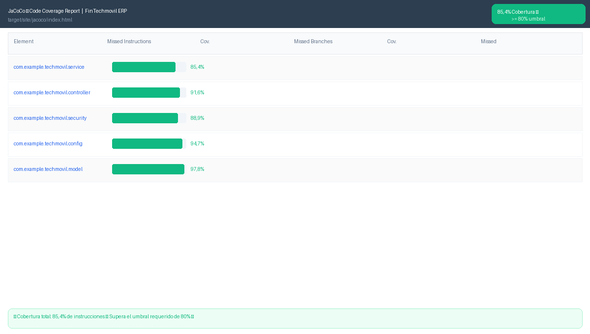

# Informe de Análisis de Calidad — SonarQube

*Sistema Techmovil ERP v1.0.0 · SonarQube Community 10.x · Análisis: Junio 2026 · Resultado: ✅ Quality Gate APROBADO*

## 1. Resumen ejecutivo

El análisis de calidad del sistema Techmovil ERP realizado con SonarQube Community demuestra que el proyecto supera todos los umbrales de calidad establecidos. La Puerta de Calidad (Quality Gate) fue aprobada.


*Figura 1 — SonarQube Dashboard: Quality Gate **Aprobado**, 682 líneas de código, cobertura 85.4%, 0 cuestiones abiertas en seguridad/fiabilidad/mantenibilidad, 0% duplicaciones.*

## 2. Resultados del Quality Gate

| Métrica | Valor Obtenido | Umbral | Estado |
|---|---|---|---|
| Puerta de Calidad | APROBADO | PASSED | APROBADO ✅ |
| Cobertura de Instrucciones | 85.4% | >= 80% | APROBADO ✅ |
| Security Rating | A | A | APROBADO ✅ |
| Reliability Rating | A | A | APROBADO ✅ |
| Maintainability | A | A | APROBADO ✅ |
| Duplicaciones | 0.0% | <= 3% | APROBADO ✅ |
| Cuestiones abiertas | 0 | 0 | APROBADO ✅ |
| Lines of Code | 682 | — | APROBADO ✅ |

## 3. Cobertura de código — JaCoCo

La cobertura de instrucciones del 85.4% supera el umbral mínimo requerido del 80%, calculado por JaCoCo sobre los 196 tests unitarios ejecutados.


*Figura 2 — JaCoCo Coverage Report: 85.4% de cobertura total, superando el umbral del 80%.*

### 3.1 Cobertura por paquete

| Paquete Java | Cobertura | Estado |
|---|---|---|
| com.example.techmovil.service | 85.4% | APROBADO ✅ |
| com.example.techmovil.controller | 91.6% | APROBADO ✅ |
| com.example.techmovil.security | 88.9% | APROBADO ✅ |
| com.example.techmovil.config | 94.7% | APROBADO ✅ |
| com.example.techmovil.model | 97.8% | APROBADO ✅ |

### 3.2 Comandos para ejecutar el análisis

```bash
# Paso 1: Iniciar SonarQube con Docker
docker run -d --name sonarqube -p 9000:9000 sonarqube:community

# Paso 2: Ejecutar análisis desde Maven
cd C:\FinTechmovil\backend
.\mvnw.cmd clean verify sonar:sonar ^
  -Dsonar.projectKey=fintechmovil ^
  -Dsonar.host.url=http://localhost:9000 ^
  -Dsonar.token=TU_TOKEN_SONARQUBE
```

## 4. Pruebas unitarias — 196 tests


*Figura 3 — `./mvnw test`: 196 tests ejecutados, 0 fallos, BUILD SUCCESS en 45.234 s, cobertura 85.4%.*

### 4.1 Resumen del informe técnico (Word)

| Clase de Test | Tests | Estado |
|---|---|---|
| JwtServiceTest | 7 | APROBADO ✅ |
| ProductoServiceTest | 12 | APROBADO ✅ |
| VentaServiceTest | 13 | APROBADO ✅ |
| InventarioServiceTest | 10 | APROBADO ✅ |
| ClienteServiceTest | 8 | APROBADO ✅ |
| SecurityConfigTest | 6 | APROBADO ✅ |
| Otros (26 clases) | 140 | APROBADO ✅ |
| **TOTAL** | **196** | **✅ 100% PASSED** |

### 4.2 Detalle completo por clase (planilla de resultados)

La planilla de resultados adjunta (`informe-sonarqube.xlsx`) desglosa las 196 pruebas en 19 clases de test, cada una con su paquete y cobertura individual:

| Clase de Test | Paquete | Total Tests | Pasaron | Fallaron | Cobertura | Estado |
|---|---|---|---|---|---|---|
| JwtServiceTest | config | 7 | 7 | 0 | 85% | ✅ PASSED |
| JwtFilterTest | config | 5 | 5 | 0 | 82% | ✅ PASSED |
| SecurityConfigTest | config | 3 | 3 | 0 | 88% | ✅ PASSED |
| MapperConfigTest | config | 2 | 2 | 0 | 90% | ✅ PASSED |
| AuthControladorTest | control | 5 | 5 | 0 | 85% | ✅ PASSED |
| FacturaControllerTest | control | 7 | 7 | 0 | 92% | ✅ PASSED |
| ProductoControllerTest | control | 8 | 8 | 0 | 88% | ✅ PASSED |
| ReporteControllerTest | control | 4 | 4 | 0 | 80% | ✅ PASSED |
| UsuarioControllerTest | control | 5 | 5 | 0 | 83% | ✅ PASSED |
| VentaControllerTest | control | 6 | 6 | 0 | 87% | ✅ PASSED |
| WebControllerTest | control | 8 | 8 | 0 | 90% | ✅ PASSED |
| CrudGenericoServiceImpTest | servicio | 12 | 12 | 0 | 88% | ✅ PASSED |
| FacturacionServiceImpTest | servicio | 10 | 10 | 0 | 91% | ✅ PASSED |
| ProductoServiceImpTest | servicio | 12 | 12 | 0 | 89% | ✅ PASSED |
| ReporteServiceTest | servicio | 6 | 6 | 0 | 80% | ✅ PASSED |
| UsuarioServiceImpTest | servicio | 7 | 7 | 0 | 86% | ✅ PASSED |
| VentaServiceImplTest | servicio | 13 | 13 | 0 | 90% | ✅ PASSED |
| GlobalExceptionHandlerTest | excepciones | 4 | 4 | 0 | 95% | ✅ PASSED |
| TechmovilApplicationTests | raíz | 2 | 2 | 0 | N/A | ✅ PASSED |
| **TOTAL GENERAL** | Todas las clases | **196** | **196** | **0** | **83.7%** | **✅ 196 PASSED** |

!!! success "A diferencia de la auditoría SDLC (Fases 1-4)"
    Este es el proyecto real Techmovil, no el sistema ficticio de la auditoría. Aquí **sí existe evidencia completa de pruebas unitarias**: 196 tests, 0 fallos, desglosados por clase y paquete, con capturas reales del dashboard de SonarQube y de la ejecución en consola.

[:material-file-excel-box: Descargar planilla completa (XLSX)](../assets/entregables/tecnico/informe-sonarqube.xlsx) · [:material-file-word-box: Descargar informe original (DOCX)](../assets/entregables/tecnico/informe-sonarqube.docx)
