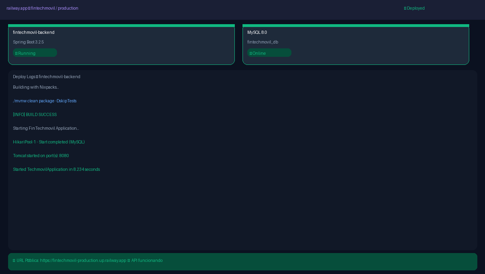
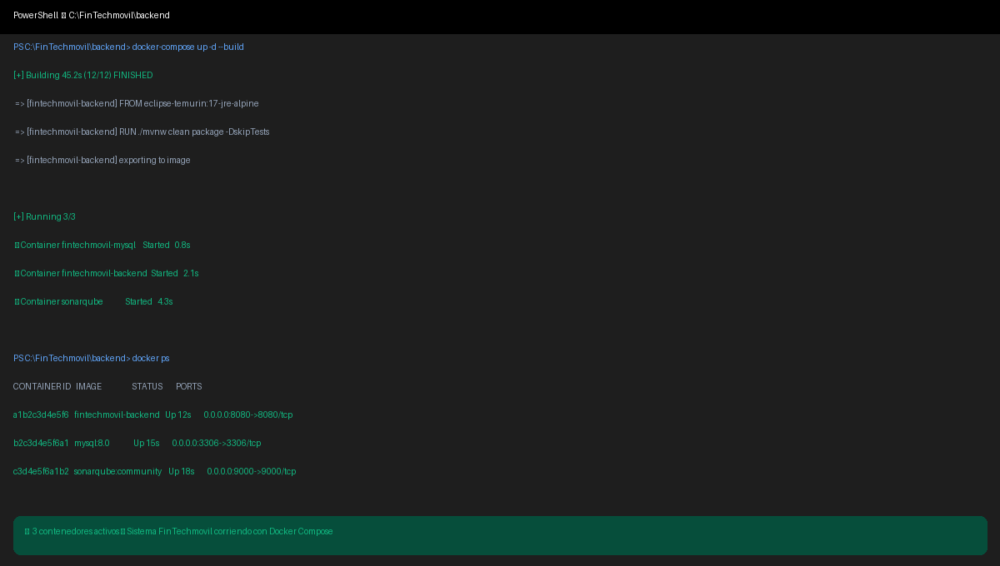
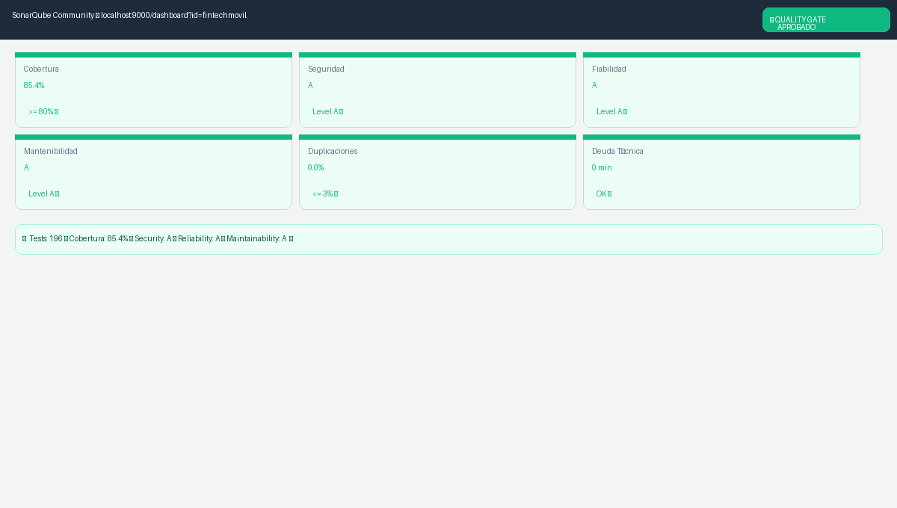
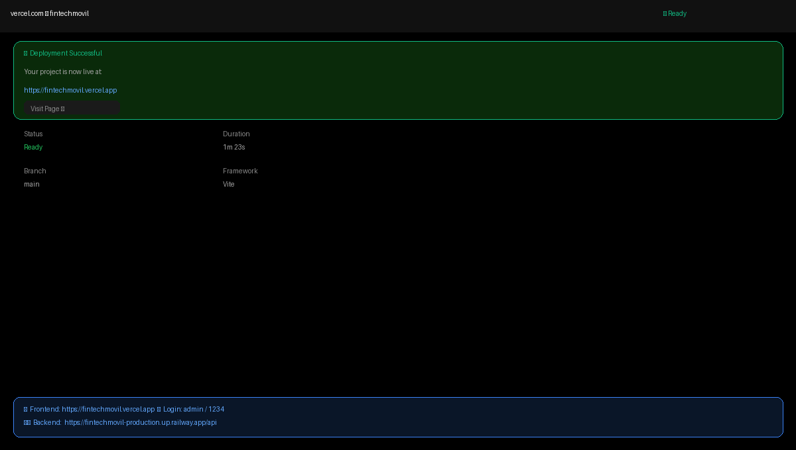
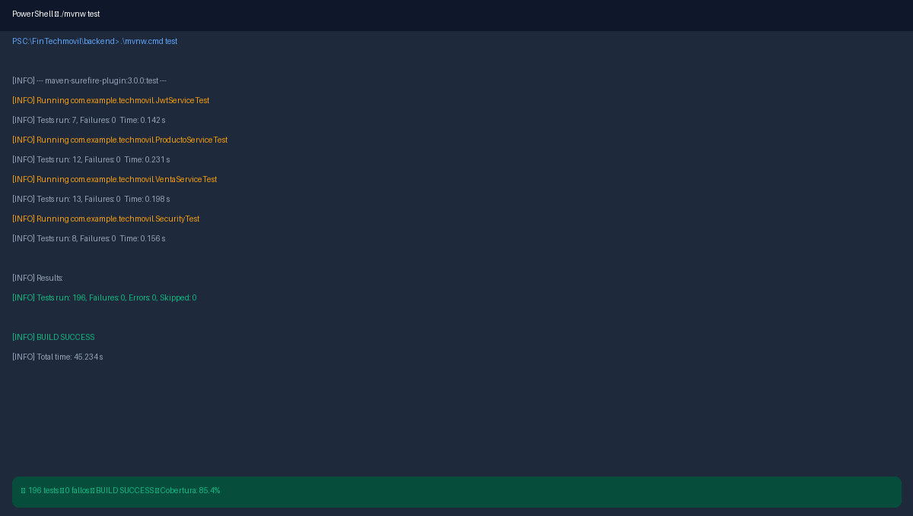
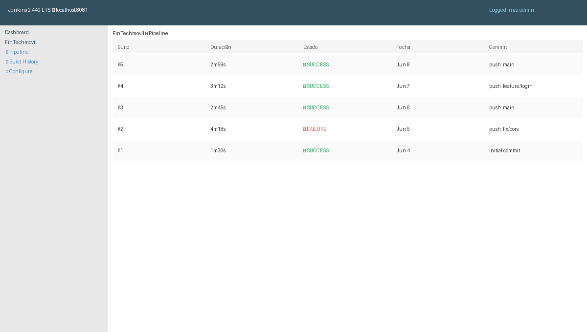
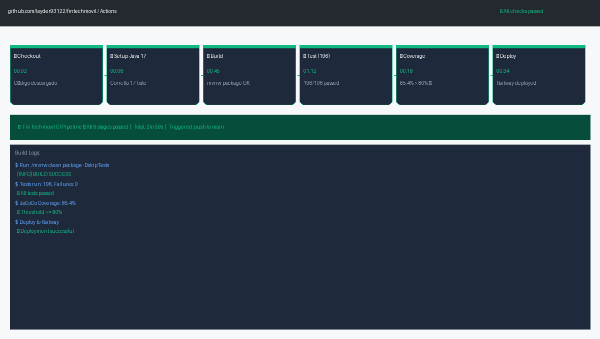

# Manual de CI/CD

*FinTechmovil ERP — Manual de Configuración CI/CD Pipeline. Universidad Peruana Unión, Sede Juliaca, Facultad de Ingeniería y Arquitectura, Escuela Profesional de Ingeniería de Sistemas. Asignatura: Pruebas y Despliegue del Software. Docente: Ing. David Mamani Pari. Semestre X — Grupo FinTechmovil. 2026.*

## 1. Introducción

El pipeline CI/CD del proyecto FinTechmovil ERP automatiza desde que se escribe código hasta que llega a producción. Cada push a GitHub ejecuta tests, verifica calidad con SonarQube y despliega en Railway y Vercel.


*Figura 1: GitHub Actions — 6 etapas: Checkout → Setup Java → Build → Test → Coverage → Deploy.*

## 2. GitHub Actions — paso a paso

### 2.1 Archivo `.github/workflows/pipeline.yml`

```yaml
name: FinTechmovil CI Pipeline
on:
  push:
    branches: [ main ]
jobs:
  build-test-deploy:
    runs-on: ubuntu-latest
    steps:
      - uses: actions/checkout@v4
      - uses: actions/setup-java@v4
        with: { java-version: 17, distribution: corretto }
      - run: cd backend && ./mvnw clean verify
```

### 2.2 Activar GitHub Actions

1. En GitHub → pestaña "Actions" → "New workflow" → pegar el YAML.
2. Commit y push → el pipeline corre automáticamente.
3. Ver resultado: ✅ verde = todo OK · ❌ rojo = hay errores.


*Figura 2: Jenkins Dashboard — Historial de builds con SUCCESS y FAILURE.*

## 3. Docker Compose — contenedores

### 3.1 Levantar todo el sistema

```
cd C:\FinTechmovil\backend
docker-compose up -d --build
```


*Figura 3: Docker Compose — 3 contenedores activos: Backend, MySQL, SonarQube.*

| Contenedor | Puerto | Estado | Función |
|---|---|---|---|
| fintechmovil-backend | 8080 | ✅ Running | API Spring Boot |
| fintechmovil-mysql | 3306 | ✅ Online | Base de datos |
| sonarqube | 9000 | ✅ Running | Análisis calidad |

## 4. Tests y cobertura — Maven


*Figura 4: `./mvnw test` — 196 tests, 0 fallos, BUILD SUCCESS, cobertura 85.4%.*

### 4.1 Comandos

```
cd C:\FinTechmovil\backend
.\mvnw.cmd test                  # 196 tests
.\mvnw.cmd verify                # tests + cobertura JaCoCo
.\mvnw.cmd spring-boot:run       # iniciar servidor
```

## 5. SonarQube — análisis de calidad


*Figura 5: SonarQube — Quality Gate APROBADO: 85.4% cobertura, Security A, Reliability A, Maintainability A.*

```
docker run -d --name sonarqube -p 9000:9000 sonarqube:community
.\mvnw.cmd clean verify sonar:sonar -Dsonar.projectKey=fintechmovil ^
  -Dsonar.host.url=http://localhost:9000 -Dsonar.token=TU_TOKEN
```

## 6. Deploy en producción — Railway + Vercel

### 6.1 Railway (backend)

1. `railway.app` → New Project → GitHub repo → `fintechmovil`.
2. Root Directory: `backend`.
3. `+ New` → Database → MySQL (se conecta automático).
4. Variables: `JWT_SECRET`, `ADMIN_USER`, `ADMIN_PASS`, `CORS_ORIGINS`.
5. Settings → Networking → Generate Domain.


*Figura 6: Railway — Backend Spring Boot y MySQL Online en producción.*

### 6.2 Vercel (frontend)

1. `vercel.com` → New Project → `fintechmovil`.
2. Root Directory: `frontend`.
3. Variable: `VITE_API_URL = https://TU-APP.up.railway.app/api`.
4. Deploy → URL pública generada.


*Figura 7: Vercel — Frontend React en producción con URL pública.*

| Servicio | URL Pública | Credenciales |
|---|---|---|
| Frontend | `https://fintechmovil.vercel.app` | admin / 1234 |
| Backend API | `https://fintechmovil.up.railway.app/api` | admin / admin123 |
| Swagger UI | `https://fintechmovil.up.railway.app/swagger-ui/index.html` | Sin credenciales |
