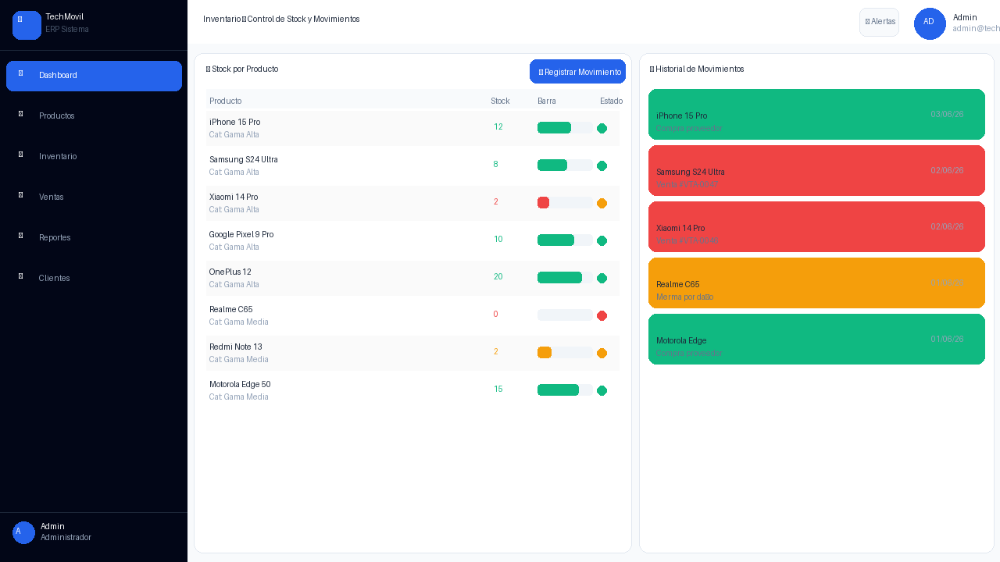
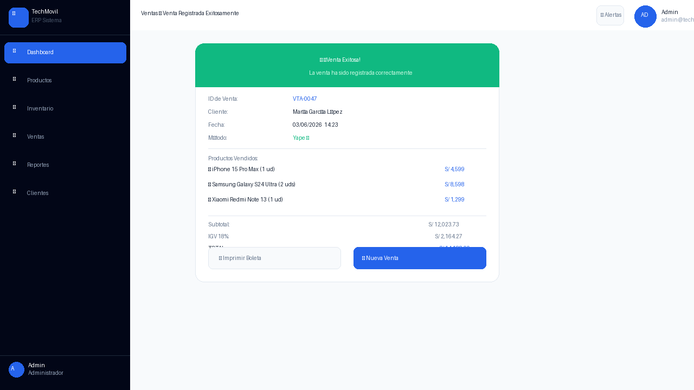
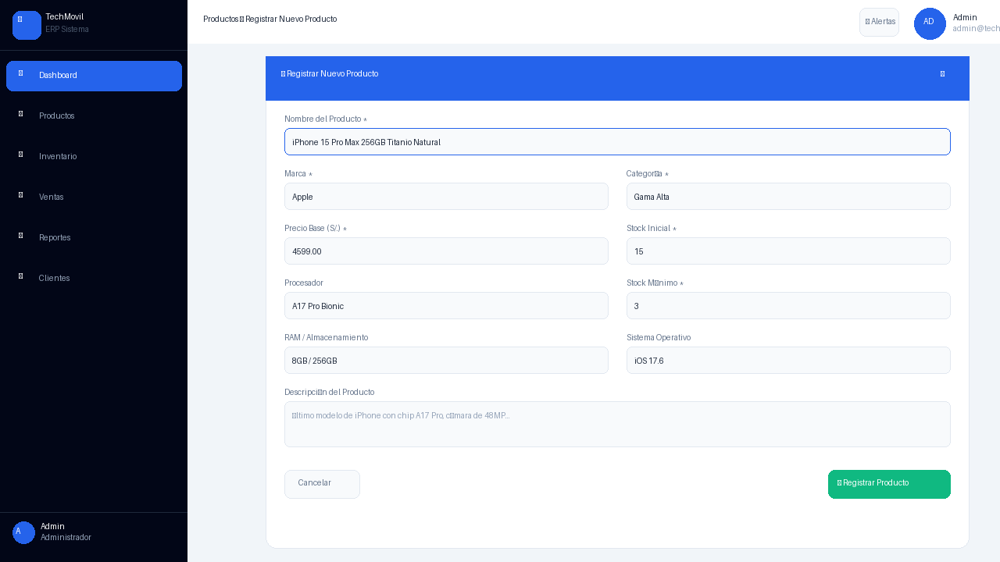
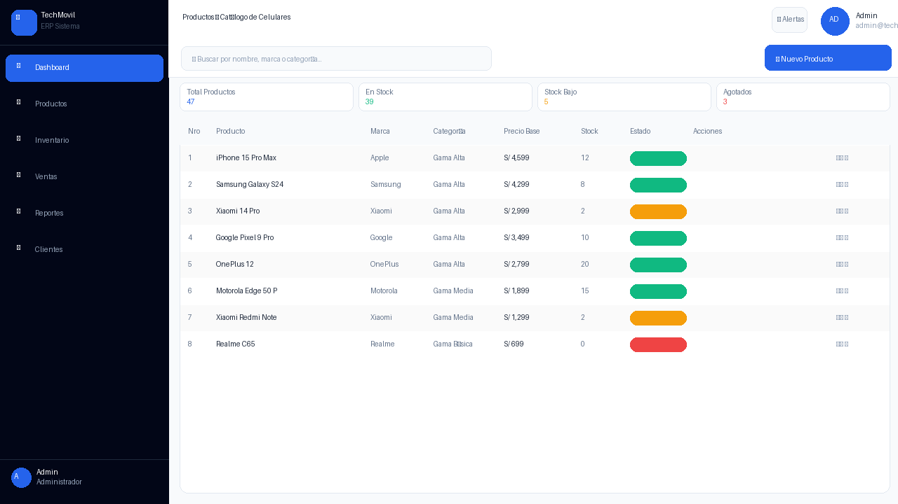
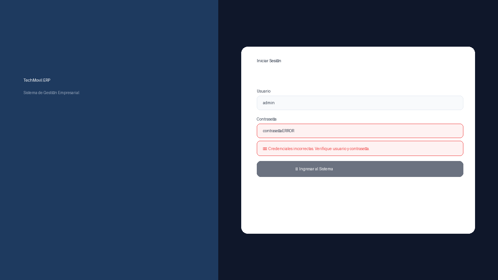
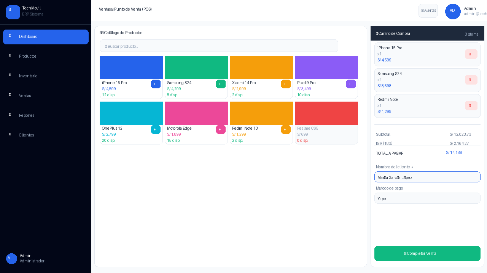

# Manual de Usuario

*Manual de Usuario — Sistema FinTechmovil ERP. Gestión de Inventario, Almacén y Ventas de Celulares. Universidad Peruana Unión, Sede Juliaca, Facultad de Ingeniería y Arquitectura, Escuela Profesional de Ingeniería de Sistemas. Asignatura: Pruebas y Despliegue del Software. Docente: Ing. David Mamani Pari. Semestre X — Grupo FinTechmovil. Juliaca – Puno – Perú, 2026.*

## Información del sistema

| Campo | Valor |
|---|---|
| Sistema | FinTechmovil ERP v1.0.0 |
| URL de Acceso | `http://localhost:5173` \| `https://fintechmovil.vercel.app` |
| Usuario | admin |
| Contraseña | 1234 |
| Módulos | Dashboard · Productos · Inventario · Ventas POS · Reportes · Clientes |

## 1. Acceso al sistema — login

Para ingresar al sistema FinTechmovil ERP:

1. Abrir Chrome en `http://localhost:5173`.
2. Campo ① Usuario: escribir `admin`.
3. Campo ② Contraseña: escribir `1234`.
4. Click en ③ "Ingresar al Sistema →".

*Figura 1: Pantalla Login FinTechmovil — ① Usuario ② Contraseña ③ Botón Ingresar.*

*Figura 2: Login fallido — aparece mensaje de error en rojo "Credenciales incorrectas".*

## 2. Dashboard — panel principal

El Dashboard se carga automáticamente al iniciar sesión. Muestra el resumen del negocio.

*Figura 3: Dashboard Principal — ① KPIs ② Gráfico ventas ③ Top productos ④ Alertas stock bajo.*

| Indicador | KPI | Descripción |
|---|---|---|
| ① Azul | Ventas Hoy | Total de ventas del día actual |
| ② Verde | Ingresos Mes | Suma total de ingresos del mes en Soles (con IGV) |
| ③ Amarillo | Stock Total | Total de unidades en el almacén |
| ④ Rojo | Alertas Stock | Productos con stock igual o menor al mínimo |

## 3. Módulo Productos

*Figura 4: Catálogo de Productos — ① Buscador en tiempo real ② Botón Nuevo Producto ③ Indicadores stock.*

### 3.1 Registrar nuevo producto

1. Click en "➕ Nuevo Producto" (botón azul arriba derecha).
2. Completar: Nombre (*), Marca (*), Precio (*), Stock (*).
3. Click en "✅ Registrar Producto".

*Figura 5: Formulario de registro — números indican el orden de llenado de campos obligatorios.*

## 4. Módulo Inventario

*Figura 6: Inventario — Panel izquierdo: stock con barras. Panel derecho: historial movimientos.*

### 4.1 Registrar movimiento

1. Click en "📦 Registrar Movimiento".
2. Seleccionar producto, tipo (📥 Entrada / 📤 Salida / 🔧 Ajuste) y cantidad.
3. Escribir el motivo → Click en "✅ Registrar".

## 5. Módulo Ventas — POS

*Figura 7: Sistema POS — ① Catálogo (click para agregar) ② Carrito ③ Botón Completar Venta.*

### 5.1 Proceso de venta

1. Click en el producto → se agrega al carrito.
2. Ingresar nombre del cliente (obligatorio).
3. Seleccionar método de pago (Efectivo, Yape, Tarjeta, etc.).
4. Verificar: Subtotal + IGV 18% = TOTAL.
5. Click en "💳 Completar Venta".

*Figura 8: Confirmación de venta — ID VTA-XXXX, cliente, productos, IGV y total calculado.*

## 6. Módulo Reportes

*Figura 9: Reportes — KPIs de ingresos, gráfico mensual, gráfico de barras y tabla de rentabilidad.*

## 7. Módulo Clientes

*Figura 10: Clientes — Tabla con historial de compras, buscador y gestión completa.*

## 8. Solución de problemas

| Problema | Causa | Solución |
|---|---|---|
| Página en blanco | Frontend no iniciado | `npm run dev` en `frontend/` |
| Credenciales incorrectas | Usuario o contraseña mal escritos | Usar exactamente `admin` / `1234` |
| Productos no cargan | Backend no está corriendo | `./mvnw spring-boot:run` en `backend/` |
| Botón Venta deshabilitado | Carrito vacío o sin cliente | Agregar producto + nombre cliente |
